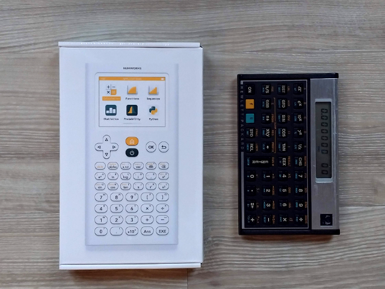
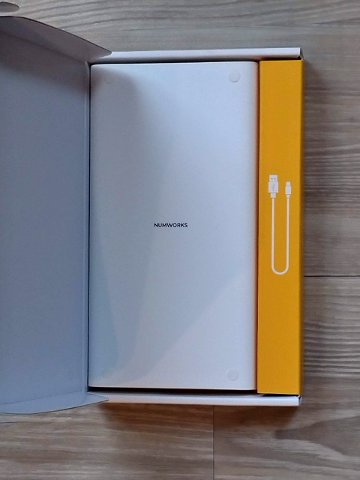
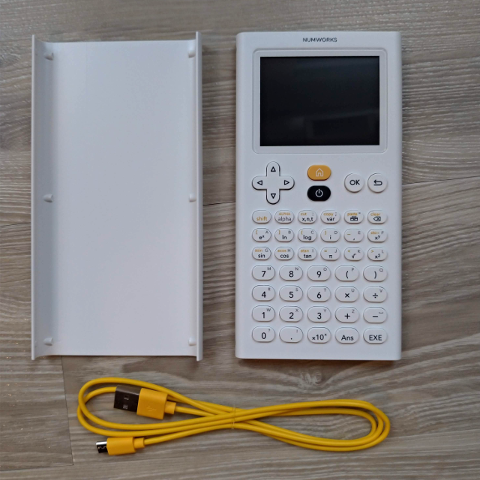
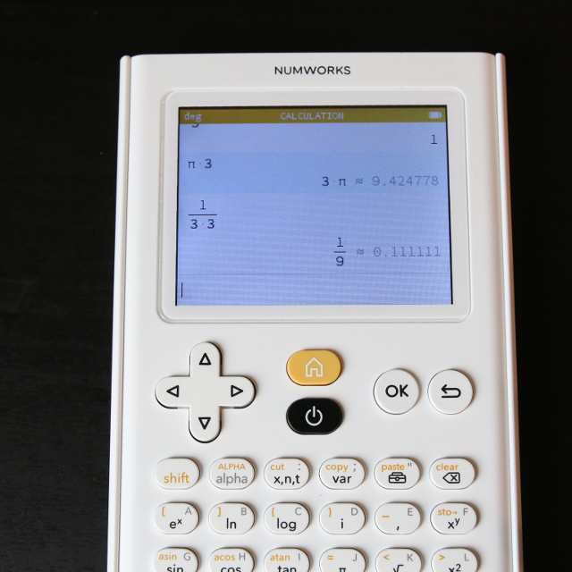
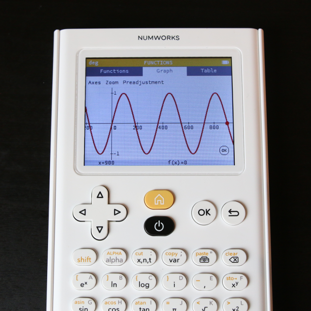

[NumWorks](https://www.numworks.com/features/)というフランスのメーカが、新しい電卓を発売した。
コンピュータがこれだけ普及しているのに「いまさら電卓なんて」という声がほとんどだと思う。しかし、次の特徴を知れば興味を持つ方もいるだろう。

* 単なる関数電卓ではなく、グラフ、数式処理、ソルバ付き。
* MicroPython によるプログラムが可能。
* 回路図、BOM、プリント基板データ、SDKを公開。
* 中身はSTM32F412。DFUで自作ファームも焼きこみ可能。

## 前書き

しばらく前に、[WP-34S](https://sourceforge.net/projects/wp34s/)というプロジェクトがあった(今もある)。HPの金融電卓(HP-20b)にオープンソースの独自ファームを書き込んで、逆ポーランド操作の科学技術計算用電卓を作るというものだ。キーの上に貼るオーバレイフィルムなどもあって、計算速度が若干遅いが実用的に動作するものだった。Linuxの上でビルドできるようにするパッチを作ったり、電子回路設計向けの独自の追加機能を実装したりして遊んでいた。マクロ機能があり、検索する限り日本語では唯一の解説記事も書いた。

しばらく設計の仕事から遠ざかっていたが、また設計の仕事になった(別の会社に移り、下っ端に戻った)。ちょうどそのタイミングで、フランスから Numworks の電卓を知った。回路図が公開されていてファームを書き換え可能な電卓、ということで触ってみなければならない。久しぶりに考えるより早く条件反射的にポチった。

フランスのメーカで製品はコレひとつ。裏面の記載によれば Model NO100と名付けられている。[ウェブサイト](https://www.numworks.com)のデザインも美しい。同様のメーカとしては [SwissMicro](https://www.swissmicros.com/)が挙げられる。久しぶりにサイトを見てみたが、DM-42が発売されていた。買ってしまいそうだ。SwissMicroは旧HPのRPN電卓のユーザをターゲットにしている。NumWorksはSAT認定を取っていることもあり、TI-84Plusなどが占めているアメリカ教育市場を主ターゲットにしているようだ。VimとVS-Codeのようなものか。

アメリカからは送料無料で$99.99 で購入可能。48時間で到着するそうだ。私のオーダーナンバーは #1360 だった。かなりマージンは取られるが[Amazon.jpと輸入業者を経由して](https://www.amazon.co.jp/dp/B0747RQGF5)日本からも買えそうだ。

余談だが、あまりにも興奮しすぎてあわてて購入したので、住所の入力を間違えてしまった。結果的にはメーカのサポート窓口に連絡して再送してもらえることになった。

## 外観

梱包やデザインも、コストは掛けないが細部まで配慮が行き届いている。キーカラーのオレンジのMicroUSBケーブルが同梱されているのも良い。

樹脂製スライドカバーが付いている、一般的な関数電卓の形。白でデザインがカッコいい。ただし、スライド動作は若干硬いように感じた。ボタンはソフトで早押し可能。早く押してもきちんと追従してくれる。コストの関係で、二色成形ではなくシルク印刷である。ただし、電源ボタンの位置があまり良くなく、つい押してしまう位置にある。

[技術解説ページ](https://www.numworks.com/resources/engineering/hardware/mechanical/)に設計思想が解説されている。樹脂成形品の筐体をデザインしている人は一読をおすすめする。

## 関数電卓として

普通の関数電卓として、また有理数を理解するので、分数は分数のままで計算が進む(小数の近似値も表示される)。通常の使用では機能不足を感じることはないだろう。行列、グラフ、ソルバ機能など、現代的な関数電卓に必要な機能はたいがい含まれている。

電卓としての機能は[シミュレータ](https://www.numworks.com/simulator/)で試すことができる。ただ、これが実機のC++で書かれた[ファームウエア](https://github.com/numworks/epsilon)と同じコードから [emscripten](https://github.com/kripken/emscripten) で生成された JavaScript で動いているとなれば、興味を持つ人もいるだろう。

## MicroPython

micro python を搭載している。iPython のような対話コンソール、数学ライブラリやグラフィックライブラリも搭載しているので単体でもいろいろと遊ぶことが出来る。しかし、[alpha]シフトを毎回押さなければ英字入力ができないのが面倒だ。一番上の段の右から2番目、ツールボックス機能で関数を選べる(先頭文字でサーチ可能)のが少しの助けになる。

<iframe width="560" height="315" src="https://www.youtube.com/embed/Xim84ABuVik" frameborder="0" allow="autoplay; encrypted-media" allowfullscreen></iframe>

## 資料

ほとんど、NumWorkのサイトへのリンク。

* [オンライン・シミュレータ](https://www.numworks.com/simulator/)
* [ユーザ・マニュアル](https://www.numworks.com/en/resources/manual/book.pdf)
* [回路図](https://www.numworks.com/shared/binary/schematics-23477ea8.pdf)
* それ以外の設計情報もウェブサイトで公開されている。とくに、機構設計については[考え方が詳しく書かれている](https://www.numworks.com/resources/engineering/hardware/mechanical/)ので、完成品の樹脂筐体を設計している人は読んでみるといいと思う。
* [ファームウエア](https://github.com/numworks/epsilon)。エミュレータもこちら。WindowsとMacでのインストール方法が書かれている。ツールチェーンは`arm-none-gcc`が使えるので、Linux上でもビルドできるだろう。

とくに、ファームウェアのソースコードについては C++で書かれている、OS無し(ベアメタルとも言う)の組み込みソフトの見本になると思う。アーキテクチャや構造がわかりやすいし、ライブラリや簡単なユニットテストツールまで含まれている。ビルド方法もMakefileで昔ながらのやり方だが、移植性を考慮して公開するなら、このような構成になるだろう。ネーミングやフォーマットなども現代的な規範に基づいている。

ファームウェア開発の初心者〜中級者の方はぜひ読んで欲しい。

## FW update

起動時にアップデートのお知らせが出ると思う。USBを使えばファームウエアのアップデートが可能だ。

1. [公式サイト](https://www.numworks.com)に行って、Resouces→[Update](https://workshop.numworks.com/devices)に進む。
2. 最初はユーザ情報(メールアドレス、パスワードなど)の登録を求められる。
3. Firefox などを使っている場合、Chrome を使うように求められる。
4. Linuxの場合、`/etc/udev/rules.d/`にルールファイルをインストールするよう求められる。
5. USBで本体を繋ぎ、リセットボタンを押すと画面が消えて待機状態となる(内部的にはおそらくDFU:Device Firmware Updateモードで起動していると思われる)。
6. ブラウザのボタンを押すと FWのインストールが始まる。
7. [MyDevices](https://workshop.numworks.com/devices) の画面にて、シリアルとバージョンなどの情報が管理される。

## 開発

本記事は入手報告のみ。実際の開発記事は、これから書く予定。Tag [numworks](https://nkon.github.io/tags#numworks) を参照して欲しい。