コロナ・引きこもり記事の第3弾。引きこもり期間中に新しいことにトライしようと思ってFirebase+Vue.jsでアプリを作ってみた。もうすこしブラッシュアップしてから公開しようと思っていたのだが、他の活動が忙しくなってしまい、時期を逃してしまいそうだ。改善の余地は多いがポストしておこう。

簡単に言うとFirebaseはサーバレスのデータベース・アプリのホスティング環境だ。データを保存するデータベース、認証フレームワーク、ウェブアプリ配信のためのホスティングURLなどを提供してくれる。小規模の場合は無償で試すことができる。

Vue.jsはアプリ構築のツールセット。JavaScriptのラッパーとして動作する。コンポーネントはHTMLで作成し、CSSで見た目を、動作をVue.jsスタイルのJavaScriptで定義する。それらをコンパイルして配布用のJavaScriptを作りFirebaseから配信する。今回はウェブアプリを作ったがiOSアプリ、Androidアプリも対応可能。ウェブアプリもiOS、Androidのホーム画面のアイコンから実行できるので、まずはウェブアプリから始めるのが良いと思う。最近は生のJavaScriptではなくTypeScriptが人気で、Vue.jsはどちらも対応している。まずは基本的なJavaScriptで入門してみた。

題材は、良くあるが「TODOリスト」にしてみた。最近、WanderlistがMicrosoftに買収されTodoがOfficeに統合されてしまって使い勝手が悪い（プライベートと仕事のアカウントを分けるという意味でも）。自分の気に入るような代替品を自分で作っておきたい、という動機もある。


0. [環境構築](#h_setup)
1. [ページ遷移の追加](#h_page_transition)
2. [FirebaseのAuthenticationでユーザ認証をする](#h_authentication)
3. [Firebaseのデータベースを設定する。アプリでデータベースのデータを表示する](#h_database)
4. [CSSで見かけを整える（Material Design）](#h_css)

この記事に沿って作成していったアプリは次のURLで稼働している。

[https://toodo-3f3dd.web.app/](https://toodo-3f3dd.web.app/)


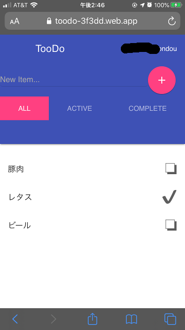

## 環境構築<a name="h_setup"></a>

OSがパッケージで提供している場合もあるがバージョンが古いことも多いので、ローカルにインストールしていく。環境はLinux(Ubuntu)を想定しているが、WSL2やmacOSなどの一般的な環境でも同様に動作するだろう。

* nvmのインストール
    + `curl -o- https://raw.githubusercontent.com/nvm-sh/nvm/v0.35.3/install.sh | bash`
    + `nvm ls-remote`で現在のリモートのバージョンをチェック→Latest LTSはv12.18.3
    + `nvm install v12.18.3`
    + `nvm ls` でv12.18.3が使われることを確認。
* npmの更新
    + `nvm install-latest-npm`
    + `npm --version` → 6.14.7。ここに環境を構築していく。
* ローカルのVue.js環境構築
    + `npm -g install @vue/cli`
    + `vue --version` → 4.4.6
* Firebase CLIのインストール
    + `npm -g install firebase-tools`

## プロジェクトの作成

`vue ui`とコマンド入力することによってでブラウザUIが起動する。そこからプロジェクトが作成できる。名前は`toodo`としてみた。

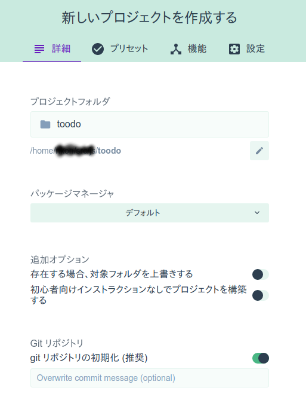

### プラグインの追加

「依存」→「依存をインストール」→「Firebase」を追加する。

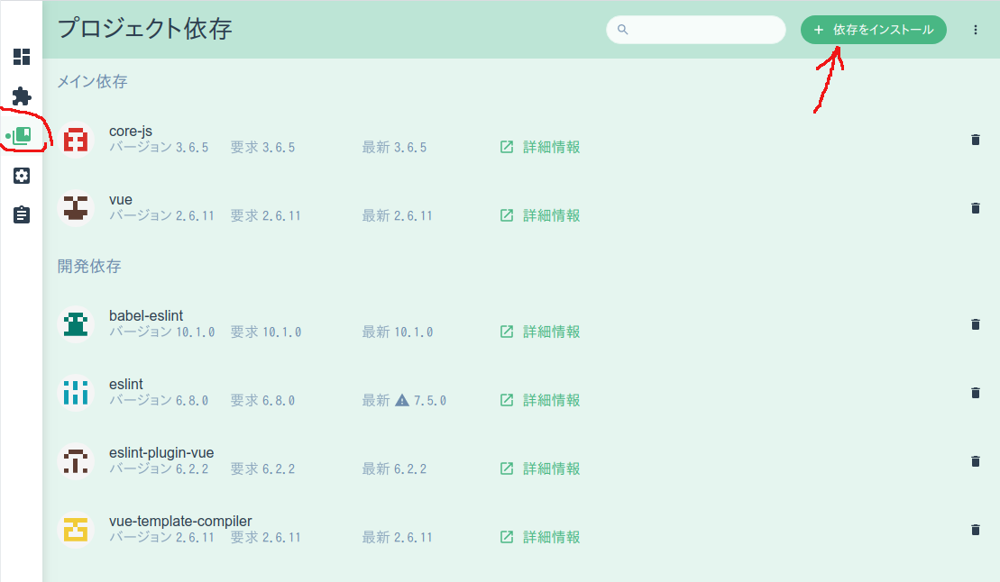
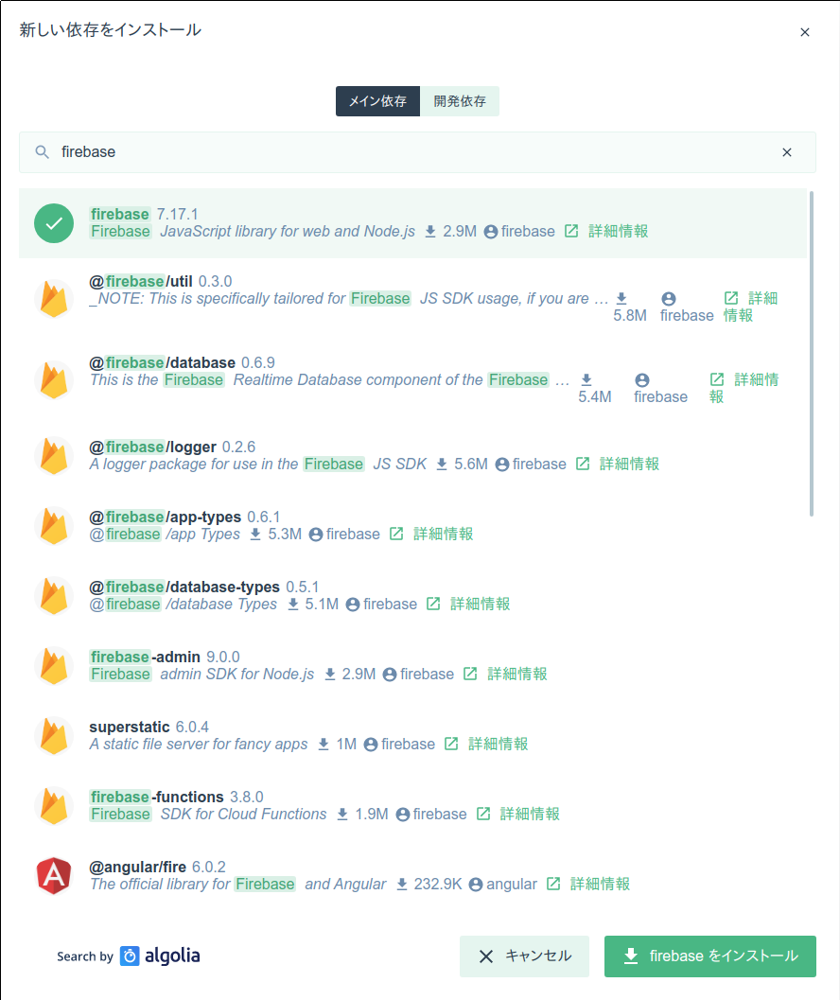
 
「プラグイン」→「Vue router」をクリックしてVue routerを追加する。

### 動作確認

「タスク」→「serve」でアプリをビルドしてブラウザで実行できる。

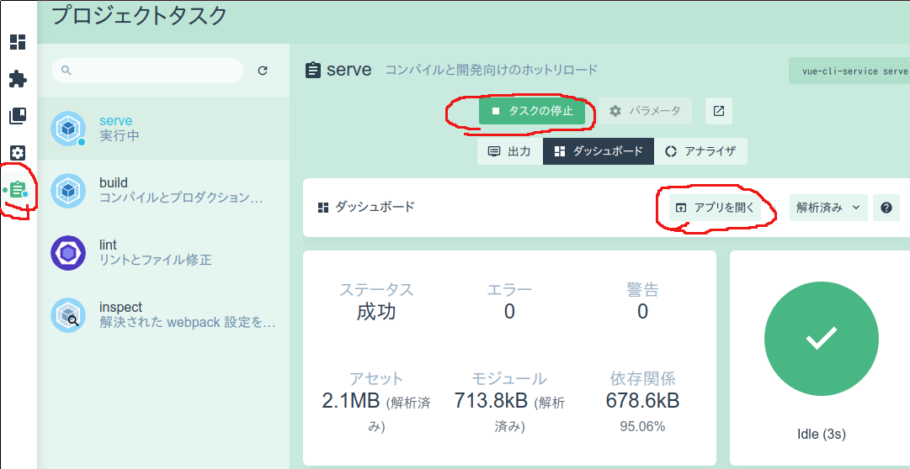

生成されたアプリをブラウザ上で実行している。

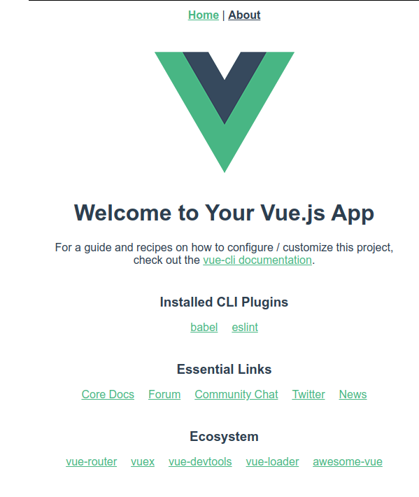

ちなみに、右クリックで「ソースを見る」としてもアプリをロードするためのHTMLが見えるだけで、ここに表示されている要素は見ることができない。HTMLのソースではなく、アプリがJavaScriptで動的に埋め込んでいるためである。`<div id="app"></div>`の部分をアプリが書き換えている。

この時点でディテクトリは次のような感じ。`node_modules/`以下に依存ライブラリがインストールされているが`.gitignore`されているので見えない。

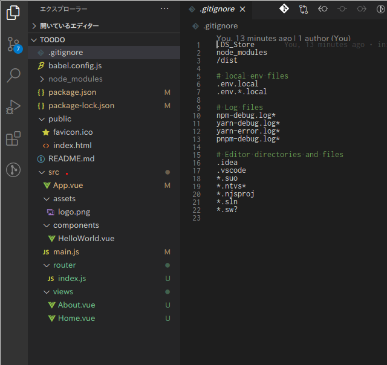

同様に、配布用のアプリを「タスク」→「build」→「タスクの実行」で生成できる。`dist/`ディレクトリに出力される。この生成結果は、あとでデプロイする時に使われる。

## Firebaseの設定

GoogleアカウントでFirebaseにログインする。

「コンソール」→「プロジェクトを追加」でプロジェクトを追加する。

* たとえば「toodo」とプロジェクト名をつけると、「toodo-abcdef」のような詳細プロジェクト名が自動生成される。
* その次のGoogleアナリティクスはデフォルトでOK。
* プロジェクトを作成」ボタンで、プロジェクトが作成される。

最初の画面で「</>（ウェブアプリ）」を追加する。


* ニックネームは好きに付けて良い。今回は「toodo」が無難だろう。
* Firebase Hostingを有効にする。さっきのアプリの詳細名（toodo-abcdef）が選択される。
* 「アプリを登録」ボタンで登録できる。

### アプリにFirebaseの設定を追加

Firebaseからは、「次のスクリプトをコピーして<body>タグの下側に貼り付けます」と書かれているがうまく行かなかった。

スクリプトをコピーして、手元のプロジェクトの`public/index.html`の`<body>`タグの次に貼り付ける。

その次のFirebase CLIは、上ですでにインストールしてあるはず。

### デプロイ

手元のコンソールで、書かれているように、次のコマンドを順に実行する。

```
$ firebase login
```

```
$ firebase init
```
ここでいくつか、アプリの設定について質問される。
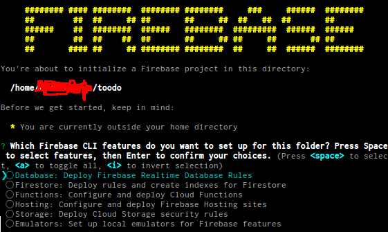

矢印キーで項目移動、SPACEで選択、ENTERで次画面。

* Database:（スペースバーを押して）有効化
* Firestore: とりあえず無効のまま
* Functions: 無効のまま
* Hosting: 有効化
* Storage: 無効のまま
* Emulators: 無効のまま

その次の画面では「Use an exisint project」→「toodo-abcdef」を選択。

言語は「JavaScript」を選択。

「What do you want to use as your public directory?」という問には、デフォルトの「public」ではなくVue.jsのビルド出力ディレクトリである「dist」を指定する。

今回はVue routerを使ってシングルページアプリを作るので、アプリのタイプは「single-page app」でOK。

```
$ firebase deploy
```
でFirebaseのサーバにデプロイできる。表示されたURL(おそらく`https://toodo-abcdef.web.app`)にアクセスすれば、アプリの画面が表示される。これは、クラウド上にデプロイされているので、スマホなどからでもアクセスが可能だ。


## Todoアプリの基礎

ここからはToDoアプリを作っていこう。
おおまかに次の順番となる。

1. [ページ遷移の追加](#h_page_transition)
2. [FirebaseのAuthenticationでユーザ認証をする](#h_authentication)
3. [Firebaseのデータベースを設定する。アプリでデータベースのデータを表示する](#h_database)
4. [CSSで見かけを整える（Material Design）](#h_css)

この手順に沿って作ったアプリは、コミット履歴とともに、次のところで公開している。文章でわかりづらいところは、更新履歴を参照していただきたい。

[https://github.com/nkon/toodo](https://github.com/nkon/toodo)


## ページ遷移の追加<a name="h_page_transition"></a>

初期に生成されたアプリは、HomeとAboutの2ページを持っていて、`src/router/index.js`でページ遷移が決定されている。

そこに、TaskとSignupの2ページを足す。

### サインインページ

未ログイン状態でアプリを開いた時にログインを促すようなページ。Googleアカウントでのログインを予定しているので、そこに飛ぶボタンだけ配置しておこう。

`src/components/Signup.vue`

```html
<template>
  <div id="signin">
    サインインページ
    <div>
      <button @click="googleLogin">Google ログイン</button>
    </div>
  </div>
</template>
<style>
</style>
<script>
```

### タスクリストページ

アプリの機能であるタスク管理のページ。本来であればタスクが並ぶはずだが、現時点では単なるページである。ユーザ名を表示できるような機能が書かれているが、この変数は、認証機能を実装したあとでないと表示されない。

`src/components/Task.vue`
```html
<template>
  <div id="task">
    タスクページ
    <p>current user: ｛｛username｝｝</p>
  </div>
</template>
<style>
</style>
```

そして、`src/router/index.js`でルーティングを再定義する。
ソースコードを見れば、なんとなく雰囲気を掴んでもらえるだろうか。

```js
import Vue from 'vue'
import VueRouter from 'vue-router'
import Home from '@/views/Home.vue'
import About from '@/views/About.vue'
import Signup from '@/components/Signup.vue'
import Task from '@/components/Task.vue'

Vue.use(VueRouter)

let router = new VueRouter({
  mode: 'history',
  routes: [
    {
      path: '/',
      name: 'Task',
      component: Task
    },
    {
      path: '/signup',
      name: 'Signup',
      component: Signup
    },
    {
      path: '/about',
      name: 'About',
      component: About
    },
    {
      path: '/home',
      name: 'Home',
      component: Home
    },
  ]
})

export default router
```

ファイルを編集・保存するたびに、即時ビルドが走り、エラーが「serve」→「出力」に表示されるのでデバッグは快適だ。


## ユーザ認証の追加<a name="h_authentication"></a>

[Firebaseのコンソール](https://console.firebase.google.com/)からプロジェクトのページに進み、「Authentication」→「Sign-in method」で「Google」を有効化する。

ユーザコードを修正して、認証情報を利用できるようにする。

この修正が完了すると、次の動作となる。

* `localhost:8080` にアクセスした時、認証がないので`/signup`にリダイレクトされる。
* `/signup`でボタンを押すと、別窓でGoogle認証が実行される。
* 認証が完了し`/`に戻ったあとは、認証情報から得られるユーザ名が表示される。

FirebaseコンソールのAuthenticationで確認して見ると、ユーザが登録されている。

### コード修正

なぜか、ドキュメントに書かれているような`index.html`にFirebaseの設定情報を書く方法がうまくいかない。回避方法として、`config/local.js`に設定情報を書いて、それを読み込むことにする。

`config/local.js`
Firebaseの「設定」→「Firebase SDK Snippet」→「構成」で表示される情報をコピペし、次のように整形する。

```js
export var firebaseConfig = {
    apiKey: "xxxxxxxxxxxxxxxxxxxxxxxxxxxxxxxxxxxxxxxxx",
    authDomain: "toodo-abcdef.firebaseapp.com",
    databaseURL: "https://toodo-abcdef.firebaseio.com",
    projectId: "toodo-abcdef",
    storageBucket: "toodo-abcdef.appspot.com",
    messagingSenderId: "01234567879",
    appId: "1:123456789:web:abcdef123456789",
    measurementId: "G-AAAAAAAAAA"
  }
```

`index.html`
```html
<!-- The core Firebase JS SDK is always required and must be listed first -->
```
で始まるFirebaseの設定情報を削除する。

`src/main.js`
次のように、`config/local.js`の情報を読み込んで`firebase`オブジェクトを初期化する。
```js
import Vue from 'vue'
import App from './App.vue'
import router from './router'
import firebase from 'firebase'                      // コレも追加
import {firebaseConfig} from '@/../config/local.js'  // コレ

Vue.config.productionTip = false
firebase.initializeApp(firebaseConfig)               // コレ
new Vue({
  router,
  render: h => h(App)
}).$mount('#app')
```

`config/`を間違えて公開してしまわないように`.gitignore`に登録する。

`src/router/index.js`

まず、`/`で`Task`が呼び出された時に、`requiresAuth`を`true`にセットする。

そうすると、下の方の関数（遷移の前に必ず呼ばれる`router.beforeEach`）でfirebaseの認証をチェックし、`currentUser`が取得できなければ`/singup`にリダイレクトする。

ついでにリファクタリングして、使っていないページ・コンポーネントを削除。

```js
import Vue from 'vue'
import VueRouter from 'vue-router'
import About from '@/views/About.vue'
import Signup from '@/components/Signup.vue'
import Task from '@/components/Task.vue'
import firebase from 'firebase'

Vue.use(VueRouter)

let router = new VueRouter({
  mode: 'history',
  routes: [
    {
      path: '/',
      name: 'Task',
      component: Task,
      meta: { requiresAuth: true }
    },
    {
      path: '/signup',
      name: 'Signup',
      component: Signup
    },
    {
      path: '/about',
      name: 'About',
      component: About
    },
  ]
})

router.beforeEach((to, from, next) => {
  let requiresAuth = to.matched.some(record => record.meta.requiresAuth)
  let currentUser = firebase.auth().currentUser
  if (requiresAuth) {
    if (!currentUser) {
      next({
        path: '/signup',
        query: {redirect: to.fullPath}
      })
    } else {
      next()
    }
  } else {
    next()
  }
})

export default router
```

`src/components/Signup.vue`

`<script>`セクションに`@click`で`googleLogin`が呼ばれた時のコードを書いていく。


```html
<template>
  <div id="signin">
    サインインページ
    <div>
      <button @click="googleLogin">Google ログイン</button>
    </div>
  </div>
</template>
<style>
</style>
<script>
import firebase from 'firebase'
import router from '../router'

export default {
  methods: {
    googleLogin: function() {
      const provider = new firebase.auth.GoogleAuthProvider()
      firebase.auth().signInWithPopup(provider).then(function() {
        router.push("/");
      }).catch(function(error) {
        alert(error.message)
      });
    }
  }
}
</script>
```

`src/components/Task.vue`

`data()`を定義し、その返り値の中で`username`変数を定義する。その変数は認証情報から得られたユーザ名を代入する。これらの変数はHTMLパートから参照できる。

```html
<template>
  <div id="task">
    タスクページ
    <p>current user: ｛｛username｝｝</p>
  </div>
</template>
<style>
</style>
<script>
import firebase from 'firebase'

export default {
    name: "Task",
    data () {
        return {
            username: firebase.auth().currentUser.displayName,
        };
    },
}
</script>
```

## データベースの設定<a name="h_database"></a>

FirebaseにはCloud FirestoreとRealtime Databaseの2種類のデータベースがある。

* Cloud Firestore
    + スケーラブル（自動）
    + ドキュメントのコレクションとしてデータを保管
* Realtime Database
    + 低レイテンシ
    + JSONツリーとしてデータを保管

[https://firebase.google.com/docs/database/rtdb-vs-firestore?hl=ja](https://firebase.google.com/docs/database/rtdb-vs-firestore?hl=ja)

今回はRealtime Databaseを使っていこう。

Firebaseのプロジェクト・コンソールから、Realtime Database→データベースを作成→テストモードで開始。

テストモードはすべの読み書きが許可されるが、30日後にアクセスが拒否される。ロックモードは、すべての読み書きが拒否され、個別に許可設定をしなければならない。

まずはテストモードで開始しよう。

これでデータベースができた。

Sparkプラン（無料）ならば、1GBまでのデータ量、10GB/月のダウンロードまで利用できる。

### データの表示

`src/Task.vue`にデータの表示を実装する。

ファイルを編集したときに、間違っていればVS Codeで赤波線が出るし、編集すれば即座にビルドが走りVue UIのserveにエラーが表示される。デバッグは非常に楽。間違って書くことが難しいぐらい。

```js
<template>
  <div id="task">
    タスクページ
    <p>current user: ｛｛username｝｝</p>
    <p>current uid: ｛｛uid｝｝</p>

    <!-- todo 一覧表示 -->
    <ul>
      <li v-for="(todo, key) in todos" :key="todo.id">
        <span>｛｛todo.name｝｝
        <a href="#" v-if="todo.isComplete==true" v-on:click="updateIsCompleteTodo(todo, key)">✔</a>
        <a href="#" v-if="todo.isComplete==false" v-on:click="updateIsCompleteTodo(todo, key)">❏</a>
        </span>
      </li>
    </ul>

  </div>

</template>
```

Vue.jsの`v-for`を使って`todos`にある要素を`｛｛todo.name｝｝`で表示していく。チェックボックスは、本来はHTMLの`<checkbox>`を使えば良いのだが、あとでスタイルを当てる時に問題となるので`v-if`でUNICODE文字を切り替えての表示とする。

デバッグ用に、usernameだけでなくuidも表示するようにしておく。

```js
import firebase from 'firebase'

export default {
    name: "Task",
    data () {
        return {
            username: firebase.auth().currentUser.displayName,
            database: null,
            todosRef: null,
            todos: [],
            uid: firebase.auth().currentUser.uid,
        };
    },
    created: function(){
      this.database = firebase.database();
      this.uid = firebase.auth().currentUser.uid;
      this.todosRef = this.database.ref("todos/" + this.uid);  // '/todos/<uid>/*' 以下を参照する。

      // データに変更があるときに実行される
      var _this = this;
      this.todosRef.on("value", (snapshot) => {
        _this.todos = snapshot.val(); // 再取得して todosに格納する。
      })
    }
}
</script>
```

`<script>`パートでは、まず`data()`でHTMLから参照する変数を定義する。

関数を作り、データベースの参照を作り、変更があれば再取得するようにする。データは`todos`に格納される。上述のとおりデータはJSON形式だ。

この状態でアプリケーションを実行しても、データがないので表示はかわらない。しかし、Firebaseのコンソールから手動にデータを入力すると、アプリの方でも表示される。


期待されるデータ構造はこのようなものだ。
ルートである`todo-xxxxxx`の下に`todos`というフォルダがある。その下にUIDのフォルダがある。3行目の暗号のような文字列はアプリページの方で確認したuidだ。
違うユーザがログインしてデータを入力していけば、別のUIDのフォルダができて、その下にデータが入っていく。

その下には各アイテムが配列で列挙され、それぞれ、`name`と`isCompleted`のプロパティを持つ。

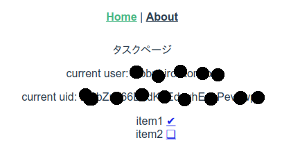

アプリ画面も期待通りのリスト表示が得られている。

ここで（旧世代人にとって）興味深いのが、データベースにデータを入力した瞬間に、アプリページは自動でデータをリロードして（DOMの書き換えによって必要箇所のみ）表示が更新される。

### データの入力

`src/Tasks.vue`にフォームを作成してデータをアプリから入力できるようにする。

```js
    <!-- New task -->
    <div>
      <input v-model="newTodoName" placeholder="New Item..."/>
      <button type="submit" v-on:click="createTodo()">ADD</button>
    </div>
```

`<template>`パートに追加。`placeholder`を使ったサポーティブなUI。`v-on:click`を使って`createTodo()`を呼ぶ。

```js
export default {
  name: "Task",
  // 省略
  methods: {
    createTodo: function() {
      if (this.newTodoName == ""){
        return;
      }
      this.todosRef.push({
        name: this.newTodoName,
        isComplete: false
      });
      this.newTodoName = "";
    },
  },
};
```

`<script>`パートでは`createTodo()`を実装する。

ここでも、`todosRefs`という変数を更新したらFirebaseサーバのデータベースに即時反映される、ということに注目しておこう。

### データの更新

`updateIsCompleteTodo()`を実装して、完了/未完了を変更できるようにしておく。

```js
export default {
  // 省略
  methods: {
    createTodo: function() {
    // 省略
    // 完了・未完了の値の更新
    updateIsCompleteTodo: function(todo, key) {
      if (todo.isComplete == true) {
        todo.isComplete = false;
      } else {
        todo.isComplete = true;
      }
      var updates = {};
      updates[key] = todo;
      this.todosRef.update(updates);
    },

  },
};

```

### データベースのルール設定

Firebaseのプロジェクトコンソール→Realtime Database→ルール　のタブでアクセスルールが設定できる。

データベースを作成時にテストモードで作成したが、アクセス権限は次のようになっていると思う。上で書かれている30日以内、ということがそのまま表現されている。

```js
{
  "rules": {
    ".read": "now < 1602478800000",  // 2020-10-12
    ".write": "now < 1602478800000",  // 2020-10-12
  }
}
```

これを次のように変更すれば、読み書きは`$user_id`と`auth.id`が一致した時に許可され、30日の制限は撤廃される。

```js
{
  "rules": {
    "todos": {
      "$user_id" : {
        ".read": "$user_id === auth.uid",
        ".write": "$user_id === auth.uid"          
      }
    }
  }
}
```

この段階までくれば、ひととおりのアプリとなる。Vue-UIでビルドして、Firebaseにデプロイすれば、該当URLにスマホからアクセスすることもできるし、ホーム画面にアイコンを貼り付けることもできる。

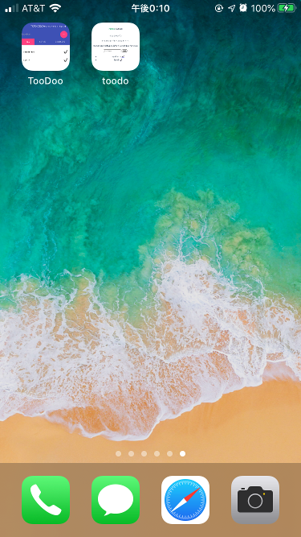
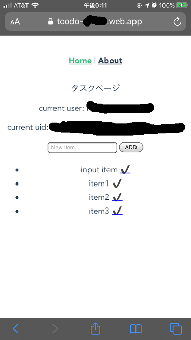

## CSSの設定<a name="h_css"></a>

すこし古いがMaterial Design Lite(MDL)を使ってみる。このセクション、あまり正確ではありません。

* `public/index.html`でCDNからMDLのCSSを読み込む。

```html
<!-- Material Design Lite -->
<meta name="viewport" content="width=device-width, initial-scale=1.0, minimum-scale=1.0">

<link rel="stylesheet" href="https://fonts.googleapis.com/icon?family=Material+Icons">
<link rel="stylesheet" href="https://code.getmdl.io/1.3.0/material.indigo-pink.min.css">
<script defer src="https://code.getmdl.io/1.3.0/material.min.js"></script>
```

### 全体のスタイルの選定

[MDLのCOMPONENTS→LAYOUTのページ](https://getmdl.io/components/index.html#layout-section)から、全体のページ構成を選択する。今回はFixed tabsにしよう。TABを選択することで「完了」「未完了」がフィルタリングして表示されるようにしたい。

まず、ページ全体を構成する`<div>`要素をコピペで貼り付けて、元のコードにあった要素をそれぞれの`<div>`要素に割り付けていく。

ただ、このままではうまく動かない（Vue.jsとMDLが干渉している）ので、これをベースに、スタイルを手で修正していく。ここは、本来、意図された使い方ではないと思う。将来の改善が必要。Material Design Componentを採用して、Vueの正しいプラグインを使うことが解決策だと考えている。

`src/Task.vue`は次のようになった。

ここまでくると、アプリらしい見た目・動作をするようになり、簡単な用途には実用できるようになってくる。

```js
<template>
  <div id="task">

    <!-- Simple header with fixed tabs. -->
    <div class="mdl-layout mdl-js-layout mdl-layout--fixed-header mdl-layout--fixed-tabs">
      <header class="mdl-layout__header">
        <div class="mdl-layout__header-row">
          <!-- Title -->
          <span class="mdl-layout-title">TooDo</span>

          <!-- Add spacer, to align navigation to the right -->
          <div class="mdl-layout-spacer"></div>
          <!-- Navigation. We hide it in small screens. -->
            <nav class="mdl-navigation mdl-layout--large-screen-only">
            ｛｛username｝｝
          </nav>
        </div>

        <!-- New task -->
        <div class="task-create">
          <div class="mdl-textfield mdl-js-textfield">
            <input class="mdl-textfield__input" type="text" v-model="newTodoName" placeholder="New Item...">
          </div>

          <button class="mdl-button mdl-js-button mdl-button--fab mdl-button--colored" type="submit" v-on:click="createTodo()">
            <i class="material-icons">add</i>
          </button>
        </div>

        <!-- Tabs -->
        <div class="mdl-layout__tab-bar mdl-js-ripple-effect">
          <a href="#fixed-tab-1" class="mdl-layout__tab" v-bind:class="{'is-active': selectedAll}" v-on:click="selectDisplay('all')">All</a>
          <a href="#fixed-tab-2" class="mdl-layout__tab" v-bind:class="{'is-active': selectedActive}" v-on:click="selectDisplay('active')">Active</a>
          <a href="#fixed-tab-3" class="mdl-layout__tab" v-bind:class="{'is-active': selectedComplete}" v-on:click="selectDisplay('complete')">Complete</a>
        </div>
      </header>

      <main class="mdl-layout__content">

        <!-- todo 一覧表示 -->
        <ul class="mdl-list">
          <li class="mdl-list__item" v-for="(todo, key) in filterdTodos" :key="todo.id">
            <span class="mdl-list__item-primary-content">｛｛todo.name｝｝</span>
            <span class="mdl-list__item-secondary-action">
              <a href="#" class="mdl-navigation__link large checked" v-if="todo.isComplete==true" v-on:click="updateIsCompleteTodo(todo, key)">✔</a>
              <a href="#" class="mdl-navigation__link large" v-if="todo.isComplete==false" v-on:click="updateIsCompleteTodo(todo, key)">❏</a>
            </span>
          </li>
        </ul>

      </main>
    </div>

  </div>
</template>

<style>
.large {
  font-size: 2em;
}

.checked {
  color: rgb(255,64,129);
}

.is-active {
  color: #ffffff;
  background: rgb(255,64,129);
}


</style>

<script>
import firebase from "firebase";

export default {
  name: "Task",
  data() {
    return {
      username: firebase.auth().currentUser.displayName,
      database: null,
      todosRef: null,
      todos: [],
      showTodoType: "all",
      selectedAll : true,
      selectedActive: false,
      selectedComplete: false,
    };
  },
  created: function () {
    this.database = firebase.database();
    this.uid = firebase.auth().currentUser.uid;
    this.todosRef = this.database.ref("todos/" + this.uid); // '/todos/<uid>/*' 以下を参照する。

    // データに変更があるときに実行される
    var _this = this;
    this.todosRef.on("value", (snapshot) => {
      _this.todos = snapshot.val(); // 再取得して todosに格納する。
    });
  },

  computed: {
    // フィルター実装。showTodoType が変更されると実行される
    filterdTodos: function() {

      if (this.showTodoType == "complete") {
        var complete_list = {};
        for (var key_c in this.todos){
          var todo_c = this.todos[key_c];
          if (todo_c.isComplete == true) {
            complete_list[key_c] = todo_c;
          }
        }
        return complete_list;
      } else if (this.showTodoType == "active") {
        var active_list = {};
        for (var key_a in this.todos){
          var todo_a = this.todos[key_a];
          if (todo_a.isComplete == false) {
            active_list[key_a] = todo_a;
          }
        }
        return active_list;
      }
      return this.todos;
    },
  },

  methods: {
    createTodo: function() {
      if (this.newTodoName == ""){
        return;
      }
      this.todosRef.push({
        name: this.newTodoName,
        isComplete: false
      });
      this.newTodoName = "";
    },
    // 完了・未完了の値の更新
    updateIsCompleteTodo: function(todo, key) {
      if (todo.isComplete == true) {
        todo.isComplete = false;
      } else {
        todo.isComplete = true;
      }
      var updates = {};
      updates[key] = todo;
      this.todosRef.update(updates);
    },

    selectDisplay: function(kind) {
      if (kind == 'all'){
        this.showTodoType = 'all';
        this.selectedAll = true;
        this.selectedActive = false;
        this.selectedComplete = false;
      } else if (kind == 'active'){
        this.showTodoType = 'active';
        this.selectedAll = false;
        this.selectedActive = true;
        this.selectedComplete = false;
      } else if (kind == 'complete') {
        this.showTodoType = 'complete';
        this.selectedAll = false;
        this.selectedActive = false;
        this.selectedComplete = true;
      }
    },

  },
};
</script>
```

それぞれのタブで、'All', 'Active', 'Completed'が表示されるようにフィルタ関数を実装した。


### アプリアイコンの設定。

* `public/index.html`でアイコンを設定しておくと、よりアプリらしくなる。

```html
<!-- Add to homescreen for Chrome on Android -->
<meta name="mobile-web-app-capable" content="yes">
<link rel="icon" sizes="192x192" href="images/android-desktop.png">

<!-- Add to homescreen for Safari on iOS -->
<meta name="apple-mobile-web-app-capable" content="yes">
<meta name="apple-mobile-web-app-status-bar-style" content="black">
<meta name="apple-mobile-web-app-title" content="Material Design Lite">
<link rel="apple-touch-icon-precomposed" href="images/ios-desktop.png">

<!-- Tile icon for Win8 (144x144 + tile color) -->
<meta name="msapplication-TileImage" content="images/touch/ms-touch-icon-144x144-precomposed.png">
<meta name="msapplication-TileColor" content="#3372DF">
```
