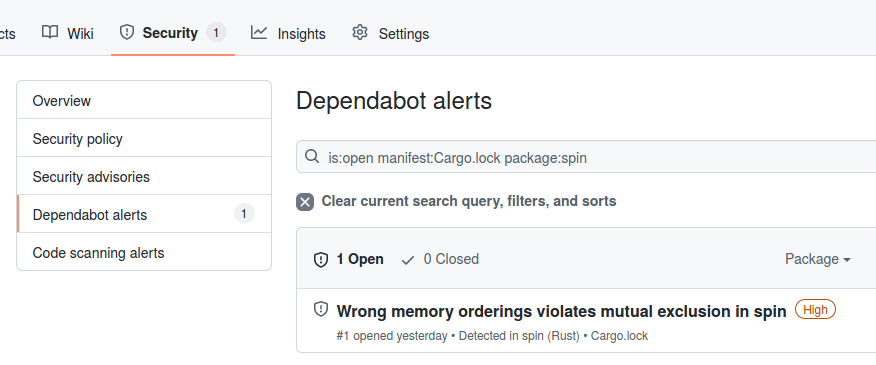

GitHubにRustのプロジェクトをアップしていると、依存しているライブラリ（直接だけでなくその先も）をボットが自動でチェックして、セキュリティ的な問題があると警告メールを送ってくる。それだけでなく、言われるがままにポチポチしていくと、修正のプルリクエストを作成してマージして完了。なにこれ、すごい。

ソフトウエアのサプライチェーン攻撃（ターゲットが使っているソフトウエアが使っているビルド環境やライブラリに対してバックドアを仕込む）が話題になっている2022年にタイムリーにこういう機能をリリースするのは関心。

## GitHub Dependency Graph

大本の情報は[こちら](https://github.blog/2022-06-06-github-brings-supply-chain-security-features-to-the-rust-community/)。

Botが依存関係をすべてチェックして、[既知のセキュリティ・アドバイザリー](https://github.com/advisories)に合致するものがあれば、レポジトリのオーナーにメールを送る。直接依存しているライブラリだけでなく、ライブラリが依存しているライブラリも対象。対象言語というか、[対象パッケージシステム](https://docs.github.com/en/code-security/supply-chain-security/understanding-your-software-supply-chain/about-the-dependency-graph#supported-package-ecosystems)は今のところ限られているが、2022-06-06にRust/Cargoがサポートされた。本当は業務で使っているCがサポートされると嬉しいのだが、パッケージ・ビルドシステムが混沌としすぎているので当面は不可能だろう。公式でパッケージ・ビルドツールまでサポートしているRustの良さが発揮されている。

## 使い方

パブリックリポジトリでは「Setting」→「Code security and analysis」→「Dependa bot alert」がデフォルトでEnableになっている。

該当事象が検知されるとメールが来る。

View All Alertsのボタンをクリックすると、次のようなページに飛ぶ。

対象となるリポジトリをクリックすると、リポジトリの「Security」タブの「Dependency Alerts」の項目に飛ぶ。

さらにオープンなアラートをクリックすると、詳細説明ページにうつる。詳細説明ページでは、原因と対策が提案されている。

さらに「Create Dependabot security update」のボタンを押すと、次のように自動でプルリクエストを作ってくれる（スクリーンショットの都合で別のレポジトリのもの）。

「Review sequrity update」から詳細を確認できる。

ここからは通常のプルリクエストと同じ。

促されるままに「Merge pull request」を押すと、対策完了。

マージされた。

すばらしい。

職場で「車輪の再発明を防ぐ（キリッ！）」と言って、5分で書けるような`int`⇔`hex`変換のワケわからんオープオンソースライブラリ（★10個）を拾ってくる、私の倍の給料をもらっている部下にも、この機能を教えてあげたい。

