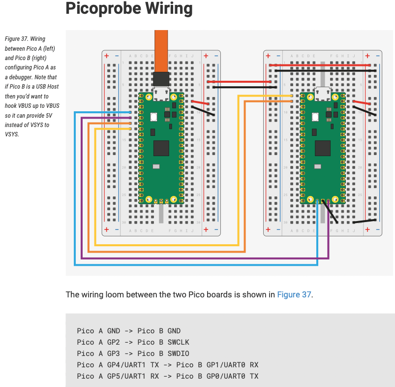
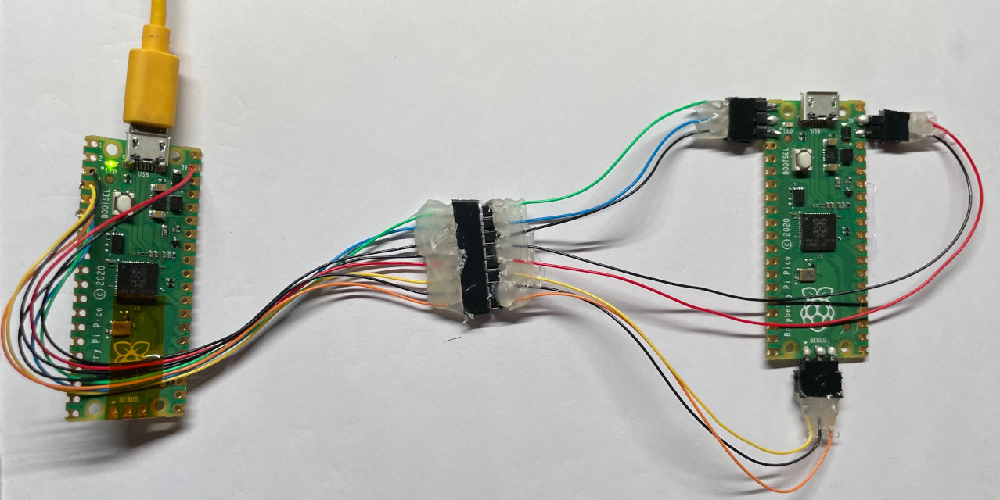
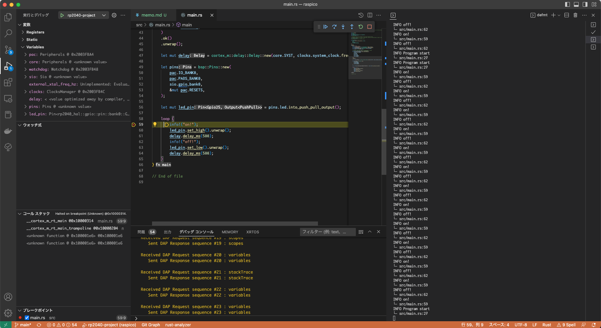

昔は組み込み=Cという感じだったが、2023年現在に、組み込み(ベアメタル)プログラミングを試してみるのであればRust+Raspberry Pi Picoの組み合わせが良いだろう。理由はいろいろあるが、１：クロスコンパイラの導入が楽。WindowsでもMacでもLinuxでも、クロスプラットフォームで楽。２：ボード、クレート(HAL)、デバッガなどの情報が豊富で、みな同じ構成を使っており選択に迷いがない。３：Rustは素晴らしいシステムプログラミング言語であり、あと数年すれば仕事で書く場合でもRust>Cとなるだろう。いまから取り組んで、Rustの概念、作法に慣れておくのがよい。残念ながらCでやることになったとしてもRust的な考え方は絶対に役に立つ。

筆者は[2017年ごろから組み込みRustに手をつけて](http://park11.wakwak.com/~nkon/homepc/rust_embedded/)いた。そのころはnightlyコンパイラが必要で、cargoではビルドできず、クレートも癖が強いものばかりだった。現状はそれと比べて、高速道路が整備されていて、非常に学習環境が良い。

# ハードウエア

Raspberry Pi Pico。RP2040というMCUの公式ボード。Pico, Pico H(ヘッダ付き), Pico W(無線付き), Pico WH(無線・ヘッダ付き)のバリエーションがある。今回は最もベーシックなPicoを使う。ボードは、2.54mmピッチで、ピンを挿すこともできるし、SMD実装も可能な端子となっている。

ボード上にはRP2040 MCU、発信器、USB Micro-Bコネクタ、電源(3.3V)、スイッチ、LED、2MBのフラッシュメモリ(QSPI接続 W25Q16JV)が載っている。

RP2040はRaspberry Piによって設計されたMCUで、次の特徴をもつ。

* Cortex M0+ 133MHz Dual Core
* 内臓SRAMは264kB
* プログラムフラッシュメモリはMCU内臓ではなくボードに外付け。コードはXIP(eXecute In Place)で外付けFlash上で実行される。16kBのコードキャッシュを内臓。
* USB 1.1 Device/Hostインターフェイス
* GPIOピンは26本
* 2xSPI, 2xI2C, 3xUART. 12bit ADC, 16ch PWM
* 8本のPIOが載っていてカスタマイズ可能なステートマシンとして自律的に動作できる
* SWDのデバッグインターフェイス

Pico WとPico WHはWirelessモデル。CYW43439が載っていてSPIでホストと繋がっている。WiFiとしては、802.11n(2.4GHz)+WPA3として、またSTA/APとして動作する。

普通にUSBに接続すると、初期状態では"RP2 Boot"というデバイスがぶら下がっているように見える。134,217,728バイト(=0x8000000バイト=128MB)のFAT16フォーマットのディスクとして認識される。ただし、実装されているのは物理的にメモリがある2MBのみ。

中には"INDEX.HTM"、"INFO_UF2.TXT"という2つのファイルがある。これは内臓ROM(書き換え不可)のブートローダによるもの。

"INDEX.HTM"を開くと、[公式サイトの製品ページ](https://www.raspberrypi.com/documentation/microcontrollers/raspberry-pi-pico.html)に飛ぶ。データシートなどがダウンロード可能。

"INFO_UF2.TXT"はUF2ブートローダのバージョン情報的なもの。

できあがったファームウエアをUF2形式に変換して、このドライブに書き込み、USBを繋ぎなおすと、そのファームウエアが実行される。再度、書き込みモードにしたいときは、基板上のBOOTSELスイッチを押しながらUSB接続すれば、初期と同様にドライブとして認識される。

# MicroPython

このUSBドライブに[MicroPythonのファームウエア](https://www.raspberrypi.com/documentation/microcontrollers/micropython.html)を書き込むと、すぐに再起動してMicroPythonの実行環境となる。USBドライブではなくUSBシリアルでREPLが繋がった状態になり、ハードを扱うために必要なライブラリはすでに組み込まれている。

詳しくは別途。。。


# セットアップ

## Rustのインストール

[公式サイト](https://rustup.rs/)に行ってインストール・ワンライナーを実行する。

## クロスコンパイラのインストール

`rustup`を使って、ターゲットを追加。RP2040はCortex-M0+なのでthumbv6mを指定。

```sh
$ rustup target install thumbv6m-none-eabi
```

Rustの場合、これだけで、クロスコンパイラがインストールされるので超絶便利。

## ユーティリティをインストール

```sh
$ cargo install flip-link elf2uf2-rs probe-run
```

+ [`flip-link`](https://github.com/knurling-rs/flip-link)は、メモリマップを変更してスタックオーバーフローを検出しやすくする技法
+ [`elf2uf2-rs`](https://github.com/JoNil/elf2uf2-rs)は、その名のとおりコンパイラのアウトプットであるELF形式のファームウエアをブートローダが理解するUF2形式に変換するユーティリティ
+ [`probe-run`](https://crates.io/crates/probe-run)は、`cargo run`したときにCMSIS-DAPプローブを経由してファームウエアをダウンロード&実行するユーティリティ

# デモプロジェクト

ゼロから書き始めるのではなく、まずはデモプロジェクトを動かし、それを改変していく。

[https://github.com/rp-rs/rp2040-project-template](https://github.com/rp-rs/rp2040-project-template)からリポジトリをクローン。それを改変していく。

```sh
$ git clone https://github.com/rp-rs/rp2040-project-template.git
$ cd rp2040-project-template
```


## Lチカ(elf2uf2-rs)

まずはLチカ。プロジェクトをクローンしてビルドする。

```sh
$ cargo build
```

ビルドの結果はELF形式で`target/thumbv6m-none-eabi/debug/rp2040-project-template`にできあがる。

`.cargo/config.toml`を修正。デフォルトでは`runner`が`probe-run`になっているが`elf2uf2-rs`を使うようにする。
```toml
# runner = "probe-run --chip RP2040"
# runner = "cargo embed"
runner = "elf2uf2-rs -d"
```
書き込みと実行。

```sh
$ cargo run
```
とすると、ファームウエアをUF2形式に変換して、RasPicoのドライブに書き込んでくれる。結果、LEDが点滅する。ソースコードを見れば、GPIO25が500ms OFF/500ms ONで切り替わっていることがわかる。

サンプルコード中、`info!()`でデバッグ出力をしているが、これはSWD経由RTTで出力されるので、"elf2uf2-rs"でUF2ファイルをドライブに書き込んだ状態では見ることができない。次節、PicoProbeで接続したときに確認できる。

### サンプルコード解説

サンプルコードに、さらに日本語でコメント追加。

```rust
//! Blinks the LED on a Pico board
//!
//! This will blink an LED attached to GP25, which is the pin the Pico uses for the on-board LED.
//! ←この形式のコメントは、このファイルに関する説明であることを表す、とcargo docに解釈される。
#![no_std]      // OSに依存するstdライブラリを使わずフリースタンディング環境でも使えるcoreライブラリのみ使う
#![no_main]     // スタートアップで初期化→`main`関数を呼び出すのではなく、直接`#[entry]`で指定された関数を実行する
                // `#![...]`は、それが含まれるモノ(ファイルなど)に対する修飾

use bsp::entry;
use defmt::*;   // `defmt`クレートが提供するデバッグプリント機能を使う
use defmt_rtt as _; // `defmt`の出力チャンネルをSWD経由で出力する"RTT"にする
use embedded_hal::digital::v2::OutputPin;
use panic_probe as _;   // `panic`時にデバッグヒント情報を出力する

// Provide an alias for our BSP so we can switch targets quickly.
// Uncomment the BSP you included in Cargo.toml, the rest of the code does not need to change.
// BSPクレートをuseするが、あとで切り替えやすいように"bsp"という名前でuseする
use rp_pico as bsp;
// use sparkfun_pro_micro_rp2040 as bsp;

// HALの以下の機能を使う
use bsp::hal::{
    clocks::{init_clocks_and_plls, Clock},
    pac,        // pac=Peripheral Access Crate
    sio::Sio,   // SIOはRP2040特有のSingle Clock I/Oという機能。その名のとおり、1クロックで実行できる高速GPIO
    watchdog::Watchdog,
};

// `#[entry]`で指定した関数が最初に実行される。
// この関数の型は、引数を取らず、戻り値を返さない(` -> ! `)
// #[...]は、その次の行のモノに対する修飾
#[entry]
fn main() -> ! {
    info!("Program start");   // `defmt`の出力。レベルはerror, info, warn, debug, traceなどがあり
                              // Cargo.tomlで実際の出力レベルを変更できる

    // rustの借用の仕組みを使ってペリフェラルのリソースを確保する。
    // https://tomoyuki-nakabayashi.github.io/book/peripherals/singletons.html
    let mut pac = pac::Peripherals::take().unwrap();
    let core = pac::CorePeripherals::take().unwrap();
    let mut watchdog = Watchdog::new(pac.WATCHDOG);
    let sio = Sio::new(pac.SIO);

    // External high-speed crystal on the pico board is 12Mhz
    let external_xtal_freq_hz = 12_000_000u32;
    let clocks = init_clocks_and_plls(
        external_xtal_freq_hz,
        pac.XOSC,
        pac.CLOCKS,
        pac.PLL_SYS,
        pac.PLL_USB,
        &mut pac.RESETS,
        &mut watchdog,
    )
    .ok()
    .unwrap();

    // Busy loopで待つ。
    // 待ち時間の計測にSysTickを使うので、他でSysTickを使う場合は注意
    let mut delay = cortex_m::delay::Delay::new(core.SYST, clocks.system_clock.freq().to_Hz());

     // ピン集合の構造体(pins)を初期化。この初期化操作で個々のピンの所有権を`pins`が獲得する
    let pins = bsp::Pins::new(
        pac.IO_BANK0,
        pac.PADS_BANK0,
        sio.gpio_bank0,
        &mut pac.RESETS,
    );

    // rp-picoクレート(BSPクレート)の中で `led`ピンがGPIO25として定義されている
    // pins経由で、`led`をプッシュプル出力に設定して、`led`の所有権を獲得する。
    let mut led_pin = pins.led.into_push_pull_output();

    loop {
        info!("on!");
        led_pin.set_high().unwrap();
        delay.delay_ms(500);
        info!("off!");
        led_pin.set_low().unwrap();
        delay.delay_ms(500);
    }
}

// End of file
```


### トラブルシューティング

基本的には、このとおりやればできるはず。

ただし、会社のパソコンなどでUSBメモリを使用禁止にしてあるものでは、このようなことは実行できない。


# USB CDCの動作確認

RasPicoボードは、シリアル出力をUSB経由で行うことができる。

[Exampleページ](https://github.com/raspberrypi/pico-examples)からビルド済みの`hello_usb`バイナリ(ファイル名は"hello_world.uf2")をダウンロードして、ドライブに書き込む。デバイスがリセットして、USBのデバイスクラスがMass Storage DeviceではなくCDC:Communication Device Classになり、文字列が出力される。

TeraTermやPuTTY, minicom, cu などのお気に入りのターミナルソフトで読むことができる。

```sh
❯ sudo cu -l /dev/tty.usbmodem0000000000001
Password:
Connected.
Hello, world!
Hello, world!
Hello, world!
Hello, world!
Hello, world!
.

Disconnected.
```
`cu`の場合は`~.`で終了。


# PicoProbe

これだけでは、実際の開発には不自由なのでCMSIS-DAPプローブを使って書き込めるようにする。


* デバッガでステップ実行が可能
* [`defmt`](https://github.com/knurling-rs/defmt)というロギングライブラリがCortex-Mの(デフォルトでは)RTT機能を使って、`println!()`などのログ出力が可能。

そのために、別のRaspberry Pi Picoに[`picoprobe.uf2`](https://github.com/rp-rs/rp2040-project-template/blob/main/debug_probes.md#raspberry-pi-pico)ファームウエアを書き込んで、デバッグプローブとする。プローブ側の`GP2`をターゲットの`SWDCLK`に、`GP3`をターゲットの`SWDIO`に接続する。

picoprobeはUSB CDC(Serial)も持っているので、ついでにUARTもつなぐ。プローブ側の`UART1_TX`(`GP4`)をターゲット側の`UART0_RX`(`GP1`)に、`UART1_RX`(`GP5`)を`UART0_TX`(`GP0`)に接続。

`GND`は`GND`と接続。プローブ側の`VSYS`とターゲット側の`VSYS`も接続。

ここまでハンダ付け作業をするのであれば、ターゲットボードの`RUN`ピンと`GND`ピンの間にタクト・スイッチを付け、リセットスイッチも設置しておくのがよいだろう。



[Getting started with Raspberry Pi Pico:C/C++ development with Raspberry Pi Pico and other RP2040-based microcontroller boards](https://datasheets.raspberrypi.com/pico/getting-started-with-pico.pdf) より



RasPicoのUSBは、上のようにMass StorageにもCDC(Serial)にもHIDにもなることができるのだが、それらはアプリケーション本来の用途に使うべきで、デバッグ出力は、ターゲットのUSBをCDCにして出力するのではなく、SWD経由のRTTや別のUARTに出力しよう、というのが基本的な考え方。もちろんUART制御が本来の用途であればCDC側にデバッグ出力するようにする。

最近は、このようにRasPico自体をデバッグプローブにするだけでなく、公式から[デバッグプローブそのもの](https://www.raspberrypi.com/documentation/microcontrollers/debug-probe.html)が発売されているので、それを利用してもよい。

## probe-rs

Pico Probeを使うときは、次のとおり。

* プローブとターゲットを接続する
* `.cargo/config.toml`で`runner`に`probe-run`を指定する
* `cargo run`を実行する
* プログラムがPicoProbe→SWD→ターゲットプローブに書き込まれ、実行が始まる。
* 実行中はLEDの点滅と `info!()`の出力が表示される。`info!()`の出力はRTT(SWD)経由。
* Ctrl-Cで実行中止。スタックトレースが表示される。Useされたクレートはホームディレクトリの下にあるのだが、下のログでは"~"に置き換えている。

```
❯ cargo run
    Finished dev [optimized + debuginfo] target(s) in 0.02s
     Running `probe-run --chip RP2040 target/thumbv6m-none-eabi/debug/rp2040-project-template`
(HOST) INFO  flashing program (3 pages / 12.00 KiB)
(HOST) INFO  success!
────────────────────────────────────────────────────────────────────────────────
INFO  Program start
└─ rp2040_project_template::__cortex_m_rt_main @ src/main.rs:27
INFO  on!
└─ rp2040_project_template::__cortex_m_rt_main @ src/main.rs:59
INFO  off!
└─ rp2040_project_template::__cortex_m_rt_main @ src/main.rs:62
INFO  on!
└─ rp2040_project_template::__cortex_m_rt_main @ src/main.rs:59
INFO  off!
└─ rp2040_project_template::__cortex_m_rt_main @ src/main.rs:62
INFO  on!
└─ rp2040_project_template::__cortex_m_rt_main @ src/main.rs:59
INFO  off!
└─ rp2040_project_template::__cortex_m_rt_main @ src/main.rs:62
^C────────────────────────────────────────────────────────────────────────────────
stack backtrace:
   0: core::ptr::read_volatile
        at /rustc/d5a82bbd26e1ad8b7401f6a718a9c57c96905483/library/core/src/ptr/mod.rs:1499:9
   1: vcell::VolatileCell<T>::get
        at ~/.cargo/registry/src/github.com-1ecc6299db9ec823/vcell-0.1.3/src/lib.rs:33:18
   2: volatile_register::RW<T>::read
        at ~/.cargo/registry/src/github.com-1ecc6299db9ec823/volatile-register-0.2.1/src/lib.rs:75:9
   3: cortex_m::peripheral::syst::<impl cortex_m::peripheral::SYST>::has_wrapped
        at ~/.cargo/registry/src/github.com-1ecc6299db9ec823/cortex-m-0.7.7/src/peripheral/syst.rs:135:9
   4: cortex_m::delay::Delay::delay_us
        at ~/.cargo/registry/src/github.com-1ecc6299db9ec823/cortex-m-0.7.7/src/delay.rs:50:24
   5: rp2040_project_template::__cortex_m_rt_main
        at src/main.rs:58:5
   6: main
        at src/main.rs:25:1
   7: Reset
(HOST) WARN  call stack was corrupted; unwinding could not be completed
(HOST) INFO  device halted by user
```

# VS code でデバッグ

* VS codeの拡張"Debugger for probe-rs"をインストール
* `$ cargo install probe-rs-debugger`
* デフォルトの設定で、いきなりデバッガ実行しようとすると「"rust: cargo build"が無い」というエラーになる。そのまま「構成を追加」ボタン押して、`.vscode/task.json`に"rust: cargo build"のエントリーを作成。
* `main.rs`の適当なところにブレークポイントを貼って実行。ステップ実行や変数ウォッチなど基本的な機能はGUIで簡単に使える。

gdbの設定とかを考えなくて良いので便利。

```.vscode/tasks.json
{
    // See https://go.microsoft.com/fwlink/?LinkId=733558
    // for the documentation about the tasks.json format
    "version": "2.0.0",
    "tasks": [
        {
            "label": "rust: cargo build",
            "type": "shell",
            "command": "cargo build"
        }
    ]
}
```



# 応用

[公式のサンプル](https://github.com/raspberrypi/pico-examples)を見ると、Cで書かれたサンプルがたくさんあって、なにができるか、どういうふうにするか、が概観できる。それを参照しながら[rp2040-hal](https://docs.rs/rp2040-hal/latest/rp2040_hal/index.html)のdocs.rsを見れば、すぐに使いこなせると思う。

USB HIDのサンプルは[rp-pico](https://github.com/rp-rs/rp-hal-boards/tree/main/boards/rp-pico)の方にある。
