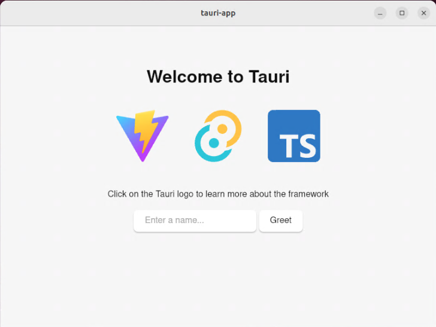
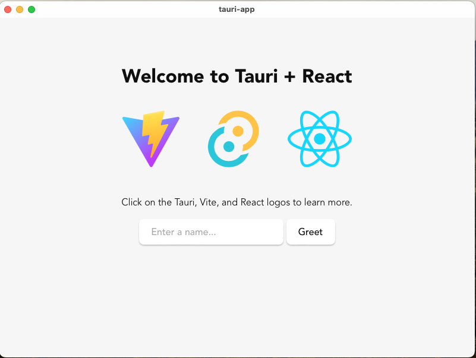
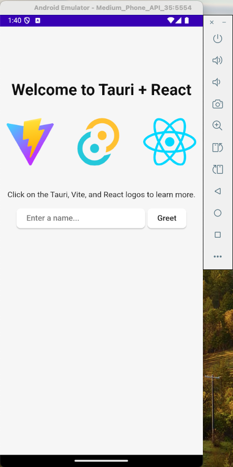
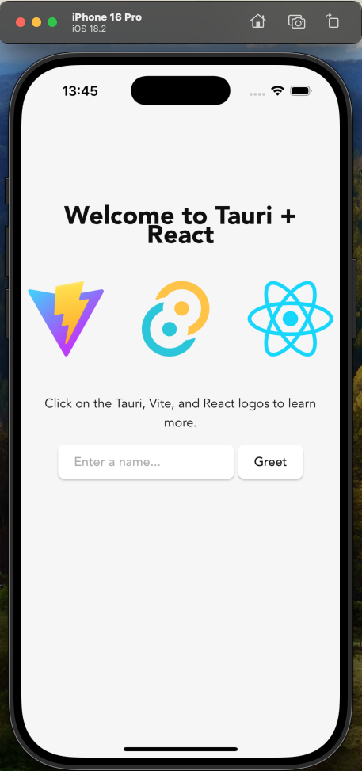

Tauriというアプリケーションフレームワークがある。フロントエンドをReactなどのウェブ技術で、バックエンドをRustで作り、作りやすさと信頼性を兼ね備えることを目標としたものだ。フロントエンドはElectronのようにChromiumを丸ごとパッケージに埋め込むのではなく、OSが持っているWebViewを利用するのでバイナリサイズが小さい。Tauri2.0からはデスクトップアプリ(Windows, macOS, Linuxのマルチプラットフォーム)だけでなくiOS、Androidのモバイルプラットフォームもサポートしている。本記事を含む数個の記事で、セットアップから簡単なアプリの作成までをを解説する。

* セットアップ(本記事)
* [簡単なアプリ(MP3プレイヤー)](../Tauri-Player1/)
* [Todo(React版)](../Tauri-Todo/)
* [Todo(rusqlite版)](../Tauri-Todo-Rusqlite/)
* [Todo(SQLプラグイン版)](../Tauri-Todo-Plugin-Sqlite/)

マルチプラットフォームのアプリフレームワークは、古くからXamarinやGtk, Qtをベースにしたものがあったが、いまいち流行っていない。原因としてはウィジェットがベース環境のUIの雰囲気と合っていなかったり、ベース環境とフレームワークの2つを覚えなければならなかったり。そうこうしているうちに、マルチプラットフォームをサポートするために、Electronベースのアプリ、マテリアルデザインが主流になってきた。しかしElectronは重い。

というわけでTauri。

<!--ts-->
- [Tauriセットアップ](#tauriセットアップ)
  - [開発ツール](#開発ツール)
    - [iOS(Xcode)](#iosxcode)
    - [Android(Android Studio)](#androidandroid-studio)
  - [プロジェクトの作成](#プロジェクトの作成)
    - [作成方法](#作成方法)
      - [組み合わせメモ(2025-01-12時点)](#組み合わせメモ2025-01-12時点)
    - [プロジェクトの作成](#プロジェクトの作成-1)
      - [初期化](#初期化)
      - [デスクトップアプリ](#デスクトップアプリ)
        - [開発用ビルド＆実行](#開発用ビルド実行)
        - [配布用パッケージの作成](#配布用パッケージの作成)
      - [Androidアプリ](#androidアプリ)
        - [プロジェクトをAndroid用に初期化する](#プロジェクトをandroid用に初期化する)
        - [開発用のビルド＆実行](#開発用のビルド実行)
        - [パッケージのビルド](#パッケージのビルド)
      - [iOSアプリ](#iosアプリ)
        - [iOS向けの初期化](#ios向けの初期化)
        - [開発用のビルド＆実行](#開発用のビルド実行-1)
        - [配布パッケージの作成](#配布パッケージの作成)
    - [実行結果](#実行結果)
  - [Tauri アプリの構造](#tauri-アプリの構造)

<!-- Created by https://github.com/ekalinin/github-markdown-toc -->
<!-- Added by: nkon, at: 2025年 2月17日 月曜日 16時08分49秒 CST -->

<!--te-->

# Tauriセットアップ

基本的に[公式ページ](https://tauri.app/jp/start/)にしたがって進めていけばよい。主要な情報は日本語でも提供されている。

## 開発ツール

もちろん Rustが必要

```
curl --proto '=https' --tlsv1.2 -sSf https://sh.rustup.rs | sh
```

Node.js。[公式サイト](https://nodejs.org/ja)に行って、インストーラをダウンロード＆実行。

`npm`をグローバルにインストールしておく。

```
sudo npm install -g npm
```

改良されたパッケージマネージャである[pnpm](https://pnpm.io/)もインストール。[Tauriプロジェクトでは`npm`よりも`pnpm`が推奨されている](https://tauri.app/start/create-project/)。

```
npm install -g pnpm@latest-10
```

### iOS(Xcode)


Mac版のデスクトップアプリ、iOSアプリを開発するのであればハードウエアとしてMac、開発ツールとしてXcodeが必要。[Appストアからインストール](https://apps.apple.com/us/app/xcode/id497799835)。

以前Xcode command line toolをインストールしていた場合、`xcodebuild`が失敗する。

```
xcode-select: error: tool 'xcodebuild' requires Xcode, but active developer directory '/Library/Developer/CommandLineTools' is a command line tools instance
```

次のようにGUI版のXcodeを選択しておく。

```
sudo xcode-select --switch /Applications/Xcode.app/Contents/Developer
```

アプリを配布するのであれば、年間$99払ってDeveloper登録をする。


### Android(Android Studio)

Androidアプリを開発するのであれば、Android Studioと指定された拡張が必要。ホストはWindows/macOS/Linuxのいずれでもよい。

1. [Android Studioをダウンロード&インストール](https://developer.android.com/studio)
2. 環境変数をセット
    ```
    export JAVA_HOME="/Applications/Android Studio.app/Contents/jbr/Contents/Home"
    ```
3. Android Studioを起動し、SDKマネージャを使って次の拡張をインストール
   * Android SDK Platform
   * Android SDK Platform-Tools
   * NDK (Side by side)
   * Android SDK Build-Tools
   * Android SDK Command-line Tools
4. 環境変数をセット
    ```
    export ANDROID_HOME="$HOME/Library/Android/sdk"
    export NDK_HOME="$ANDROID_HOME/ndk/$(ls -1 $ANDROID_HOME/ndk)"
    ```
5. rustのビルドターゲットをインストール
   ```
    rustup target add aarch64-linux-android armv7-linux-androideabi i686-linux-android x86_64-linux-android
   ```

## プロジェクトの作成

### 作成方法

いろいろな[プロジェクト作成方法](https://tauri.app/jp/start/create-project/)があるが、Tauriプロジェクトでは`pnpm`を使う方法を推奨している。

残念ながら、試してみたところCargoを使って生成したプロジェクトではiOSアプリが正常に動作しなかった。

また、プロジェクト作成方法によっては取れる選択肢が異なってくる。

以降の記事では、プロジェクトの作成=`pnpm`、FrontEnd=JavaScript、package manager=pnpm、UI Template=React、UI flavor=JavaScriptを選択する。

* Bash
* PowerShell
* npm
    ```
    npm create tauri-app@latest
    ```
* Yarn
* pnpm
    ```
    pnpm create tauri-app
    ```
* deno
* bun
* Cargo
    ```
    cargo install create-tauri-app --locked
    cargo create-tauri-app
    ```


#### 組み合わせメモ(2025-01-12時点)

|                 | 1                      | 2                     | 3                       | 4                       | 5                       |
| --------------- | ---------------------- | --------------------- | ----------------------- | ----------------------- | ----------------------- |
| create project  | cargo create tauri-app | pnpm create tauri-app | pnpm create tauri-app   | pnpm create tauri-app   | pnpm create tauri-app   |
| Frontend        | Rust(cargo)            | Rust(cargo)           | TypeScript / JavaScript | TypeScript / JavaScript | TypeScript / JavaScript |
| package manager |                        |                       | pnpm                    | pnpm                    | pnpm                    |
| UI template     | Vanilla                | Vanilla               | Vanilla                 | React                   | React                   |
| UI flavor       |                        |                       | JavaScript              | JavaScript              | TypeScript              |
| desktop app     | ✔                      | ✔                     | ✔                       | ✔                       | ✔                       |
| android app     | ✔                      | ✔                     | ✔                       | ✔                       | ✔                       |
| ios app         | ✘ Build error          | ✘ Build error         | ✔                       | ✔                       | ✔                       |

* FrontendにRust(cargo)を使った場合はiOSアプリのビルドがうまく行かない(#1, #2)。
* `pnpm`を使うことにする(#3,#4,#5)。
* `npm`でも同様に動作するし、Web上での情報も多い。`pnpm`のほうがライブラリのダウンロードを節約できるので、上位互換で優れている。
* 純粋にTauriに入門するのであれば UI template はVanillaのほうが単純で優れている。
* しかし、ある程度の規模のアプリの場合、Reactなどのフレームワークの導入が必要。
* 昔はVue.jsを使っていたが、今はReactのほうがシェアが高く、ライブラリも豊富なようだ。
* フロントエンド言語も、同様にTypeScriptのほうが大規模開発には適しているが、シンプルにいくならJavaScript。

上の#4での実行例を示す。


### プロジェクトの作成

`pnpm create tauri-app`というコマンドで、`tauri-app`というプロジェクトが生成される。

このプロジェクトテンプレートは、文字の入力欄があり、名前を入力すると「挨拶」を返してくれる。当然、マルチプラットフォームで動作する。

```
❯ pnpm create tauri-app
✔ Project name · tauri-app
✔ Identifier · com.tauri-app.app
✔ Choose which language to use for your frontend · TypeScript / JavaScript - (pnpm, yarn, npm, deno, bun)
✔ Choose your package manager · pnpm
✔ Choose your UI template · React - (https://react.dev/)
✔ Choose your UI flavor · JavaScript

Template created! To get started run:
  cd tauri-app
  pnpm install
  pnpm tauri android init
  pnpm tauri ios init

For Desktop development, run:
  pnpm tauri dev

For Android development, run:
  pnpm tauri android dev

For iOS development, run:
  pnpm tauri ios dev
```

#### 初期化

`pnpm install`とすれば、必要なJavaScroptパッケージがインストールされる。

```
❯ pnpm install
Packages: +66
++++++++++++++++++++++++++++++++++++++++++++++++++++++++++++++++++
Progress: resolved 117, reused 66, downloaded 0, added 66, done

dependencies:
+ @tauri-apps/api 2.2.0
+ @tauri-apps/plugin-opener 2.2.3
+ react 18.3.1 (19.0.0 is available)
+ react-dom 18.3.1 (19.0.0 is available)

devDependencies:
+ @tauri-apps/cli 2.2.4
+ @vitejs/plugin-react 4.3.4
+ vite 6.0.7

The following dependencies have build scripts that were ignored: esbuild
To allow the execution of build scripts for these packages, add their names to "pnpm.onlyBuiltDependencies" in your "package.json", then run "pnpm rebuild"

Done in 2.1s
```


#### デスクトップアプリ

##### 開発用ビルド＆実行
```
❯ pnpm tauri dev

> tauri-app@0.1.0 tauri /.../tauri-app
> tauri "dev"

    Running BeforeDevCommand (`pnpm dev`)

> tauri-app@0.1.0 dev /.../tauri-app
> vite


  VITE v6.0.7  ready in 639 ms

  ➜  Local:   http://localhost:1420/
    Info Watching /.../src-tauri for changes...
    Updating crates.io index
     Locking 490 packages to latest compatible versions
      Adding proc-macro-crate v2.0.0 (available: v2.0.2)
      Adding serialize-to-javascript v0.1.1 (available: v0.1.2)
      Adding serialize-to-javascript-impl v0.1.1 (available: v0.1.2)
   Compiling proc-macro2 v1.0.93
   Compiling unicode-ident v1.0.14
   Compiling cfg-if v1.0.0
   Compiling libc v0.2.169
   Compiling serde v1.0.217
   Compiling byteorder v1.5.0
   Compiling autocfg v1.4.0
中略
   Compiling open v5.3.2
   Compiling tauri-app v0.1.0 (/.../src-tauri)
   Compiling tauri-macros v2.0.4
    Finished `dev` profile [unoptimized + debuginfo] target(s) in 46.38s
     Running `target/debug/tauri-app`
```
* Safariの上でアプリが起動する。
* 上記のように VITEの開発サーバがhttp://localhost:1420/で起動しているので、ブラウザでアクセスしてもウェブアプリとして動作する


##### 配布用パッケージの作成
```
❯ pnpm tauri build

> tauri-app@0.1.0 tauri /.../tauri-app
> tauri "build"

    Running beforeBuildCommand `pnpm build`

> tauri-app@0.1.0 build /.../tauri-app
> vite build

vite v6.0.7 building for production...
✓ 30 modules transformed.
dist/index.html                   0.46 kB │ gzip:  0.30 kB
dist/assets/react-CHdo91hT.svg    4.13 kB │ gzip:  2.05 kB
dist/assets/index-B3KA1C1_.css    1.37 kB │ gzip:  0.65 kB
dist/assets/index-Bh40L9nR.js   144.37 kB │ gzip: 46.52 kB
✓ built in 295ms
   Compiling tauri-app v0.1.0 (/.../tauri-app/src-tauri)
    Finished `release` profile [optimized] target(s) in 15.70s
    Built application at: /.../tauri-app/src-tauri/target/release/tauri-app
    Bundling tauri-app.app (/.../tauri-app/src-tauri/target/release/bundle/macos/tauri-app.app)
    Bundling tauri-app_0.1.0_aarch64.dmg (/.../tauri-app/src-tauri/target/release/bundle/dmg/tauri-app_0.1.0_aarch64.dmg)
    Running bundle_dmg.sh
failed to bundle project: error running bundle_dmg.sh: `failed to run /.../tauri-app/src-tauri/target/release/bundle/dmg/bundle_dmg.sh`
    Error failed to bundle project: error running bundle_dmg.sh: `failed to run /.../tauri-app/src-tauri/target/release/bundle/dmg/bundle_dmg.sh`
 ELIFECYCLE  Command failed with exit code 1.
```
* macOSの場合は.dmgファイルが作成される。
* Linuxの場合はAppImage, dpkg, rpmが作成される。
* Windowsの場合は試していない。
* クロスビルドする方法は不明。
* GitHubのCIで、各プラットフォームでセルフビルドするのが良さそう。

#### Androidアプリ

##### プロジェクトをAndroid用に初期化する

```
❯ pnpm tauri android init

> tauri-app@0.1.0 tauri /.../tauri-app
> tauri "android" "init"

Generating Android Studio project...
    Info "/.../src-tauri" relative to "/.../tauri-app/src-tauri/gen/android/tauri_app" is "../../../"
victory: Project generated successfully!
    Make cool apps! 🌻 🐕 🎉
```

##### 開発用のビルド＆実行
```
❯ pnpm tauri android dev

> tauri-app@0.1.0 tauri /.../tauri-app
> tauri "android" "dev"

    Info Starting emulator Medium_Phone_API_35
INFO    | Android emulator version 35.2.10.0 (build_id 12414864) (CL:N/A)
INFO    | Graphics backend: gfxstream
中略
```
→エミュレータ上でアプリが起動する

##### パッケージのビルド
```
❯ pnpm tauri android build
中略
    Finished 1 APK at:
        /.../tauri-app/src-tauri/gen/android/app/build/outputs/apk/universal/release/app-universal-release-unsigned.apk

    Finished 1 AAB at:
        /.../tauri-app/src-tauri/gen/android/app/build/outputs/bundle/universalRelease/app-universal-release.aab
```
いろいろなターゲット向けにビルドされ、APKパッケージとAABパッケージが作成される。


#### iOSアプリ

##### iOS向けの初期化
```
❯ pnpm tauri ios init

> tauri-app@0.1.0 tauri /.../tauri-app
> tauri "ios" "init"

    Info detected rustc version 1.84.0 (9fc6b4312 2025-1-7)
/opt/homebrew/bin/xcodegen
    Info package `xcodegen` present: true
/opt/homebrew/bin/idevicesyslog
    Info package `libimobiledevice` present: true
/opt/homebrew/bin/pod
    Info package `cocoapods` present: true
Apple dependencies are up to date
    Info "/.../tauri-app/src-tauri" relative to "/.../tauri-app/src-tauri/gen/apple" is "../../"
Generating Xcode project...
⚙️  Generating plists...
⚙️  Generating project...
⚙️  Writing project...
Created project at /.../tauri-app/src-tauri/gen/apple/tauri-app.xcodeproj
victory: Project generated successfully!
    Make cool apps! 🌻 🐕 🎉
```

##### 開発用のビルド＆実行
```
❯ pnpm tauri ios dev

~/s/r/tauri-app on  main [?] via  v22.11.0 took 7s
❯ pnpm tauri ios dev

> tauri-app@0.1.0 tauri /.../tauri-app
> tauri "ios" "dev"

/opt/homebrew/bin/ios-deploy
    Info package `ios-deploy` present: true
Detected iOS simulators:
  [0] iPad (10th generation)
  [1] iPad Air 11-inch (M2)
  [2] iPad Air 13-inch (M2)
  [3] iPad Pro 11-inch (M4)
  [4] iPad Pro 13-inch (M4)
  [5] iPad mini (A17 Pro)
  [6] iPhone 16
  [7] iPhone 16 Plus
  [8] iPhone 16 Pro
  [9] iPhone 16 Pro Max
  [10] iPhone SE (3rd generation)
  Enter an index for a simulator above.
Simulator: 8
    Info Starting simulator iPhone 16 Pro
    Running BeforeDevCommand (`pnpm dev`)

> tauri-app@0.1.0 dev /.../tauri-app
> vite


  VITE v6.0.7  ready in 248 ms

  ➜  Local:   http://localhost:1420/
Building app...
Command line invocation:
    /Applications/Xcode.app/Contents/Developer/usr/bin/xcodebuild -allowProvisioningUpdates -scheme tauri-app_iOS -workspace /.../tauri-app/src-tauri/gen/apple/tauri-app.xcodeproj/project.xcworkspace/ -sdk iphonesimulator -configuration debug build

User defaults from command line:
    IDEPackageSupportUseBuiltinSCM = YES

Build settings from command line:
    SDKROOT = iphonesimulator18.2

--- xcodebuild: WARNING: Using the first of multiple matching destinations:
{ platform:iOS Simulator, id:dvtdevice-DVTiOSDeviceSimulatorPlaceholder-iphonesimulator:placeholder, name:Any iOS Simulator Device }
{ platform:iOS Simulator, id:BDF6EC41-062B-4275-AE44-AC18152B6583, OS:18.2, name:iPad (10th generation) }
{ platform:iOS Simulator, id:78E23F54-49AB-4095-9CA2-A31902254C58, OS:18.2, name:iPad Air 11-inch (M2) }
中略
```
→エミュレータ上でアプリが実行される

##### 配布パッケージの作成

※上述のとおり、Developer のサブスクライブが必要。
```
❯ open src-tauri/gen/apple/tauri-app.xcodeproj
```
Xcodeを起動し、Signing & capabilityから適切にTeamを設定する。

```
❯ pnpm tauri ios build

> tauri-app@0.1.0 tauri /Users/nkon/src/rust/tauri-app
> tauri "ios" "build"

    Running beforeBuildCommand `pnpm build`
中略
bundle at path "/var/folders/22/qkys0vq91kzbfk475w53257m0000gn/T/tauri-app_iOS_2025-01-12_18-53-49.530.xcdistributionlogs".
Exported tauri-app_iOS to: /Users/nkon/src/rust/tauri-app/src-tauri/gen/apple/build
    Finished 1 iOS Bundle at:
        /Users/nkon/src/rust/tauri-app/src-tauri/gen/apple/build/arm64/tauri-app.ipa
```
ipaが生成される。

### 実行結果

Linuxデスクトップアプリ


MacOSデスクトップアプリ


Androidアプリ(シミュレータ)


iOSアプリ(シミュレータ)



## Tauri アプリの構造

`pnpm create tauri-app`で生成されたTauriアプリの基本的な構造は次のとおり。

* `src-tauri/`にRustのサブプロジェクト(通常の`cargo new`で作られたものと同様)が入っている。
    + `src/main.rs`は`tauri_app_lib::new()`を呼ぶだけ。
    + `src/lib.rs`はRustのコードのライブラリとしてのフロントエンドとエントリーポイント。
        - `src/gen/`にはiOSやAndroidアプリのために生成されたコードたち。XcodeやAndroid Studioの生成コードもここに入る。
    + `target/`には生成されたバイナリが入る。iOSやAndroidのバイナリも、この中のサブディレクトリ。  
* `src/`にはReactのコードが入っている。
    + `main.jsx`はルートページが入ってて`App.jsx`を読み込む。
    + `App.jsx`はアプリのページを生成する。個々の部品は別ファイルで作られ、`App.jsx`に読み込まれる。
    + `App.css`は表示制御用のCSS。
* `public/`はReactコードから呼ばれるアセット。最終的にはアプリバイナリに埋め込まれる。 

```
tauri-app/
├── vite.config.js
├── src-tauri/           Rustの「サブプロジェクト」
│  ├── tauri.conf.json
│  ├── target/          Rustのコードをビルドした生成物
│  ├── src/             Rustのソースコード
│  │  ├── main.rs
│  │  └── lib.rs
│  ├── migrations/
│  ├── icons/
│  ├── gen/            iOSアプリ、Andoridアプリのための自動生成物
│  │  ├── schemas/
│  │  ├── apple/
│  │  └── android/
│  ├── Cargo.toml
│  ├── Cargo.lock
│  ├── capabilities/
│  │  └── default.json
│  ├── build.rs
│  └── .gitignore
├── src/               Reactのソースコード
│  ├── main.jsx
│  ├── assets/
│  │  └── react.svg
│  ├── App.jsx
│  └── App.css
├── README.md
├── public/           Reactから呼ばれるアセットたち
│  ├── vite.svg
│  ├── tauri.svg
│  ├── audio/
│  │  └── sample.mp3*
│  └── .DS_Store
├── pnpm-lock.yaml
├── package.json
├── node_modules/    Node.jsのライブラリたち
│  ├── vite -> .pnpm/vite@6.0.7/node_modules/vite/      pnpmはシンボリックリンクを使ってライブラリ容量を低減する
│  ├── .vite-temp/
│  ├── .vite/
│  ├── .pnpm-workspace-state.json
│  ├── .pnpm/
│  ├── .modules.yaml
│  └── .bin/
│     ├── vite*
│     ├── tauri*
│     └── browserslist*
├── index.html
├── dist/
│  ├── vite.svg
│  ├── tauri.svg
│  ├── index.html
│  ├── audio/
│  │  └── sample.mp3*
│  ├── assets/
│  │  ├── react-CHdo91hT.svg
│  │  ├── index-DKx3ij1n.js
│  │  └── index-B3KA1C1_.css
│  └── .DS_Store
├── .vscode/
│  └── extensions.json
├── .gitignore
├── .git/

```


つぎは、このテンプレートに、自分の好みの機能を追加していく。最初はMP3プレイヤーを追加してみよう。

* [簡単なアプリ(MP3プレイヤー)](../Tauri-Player1/)
* [Todo(React版)](../Tauri-Todo/)
* [Todo(rusqlite版)](../Tauri-Todo-Rusqlite/)
* [Todo(SQLプラグイン版)](../Tauri-Todo-Plugin-Sqlite/)