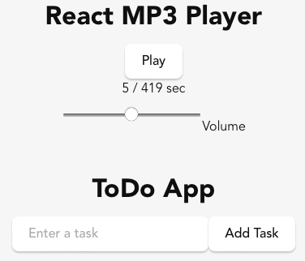

Tauriの練習問題として簡単なMP3プレイヤーを作る。

* [セットアップ](../Tauri-Setup/)
* 簡単なアプリ(MP3プレイヤー)(本記事)
* [Todo(React版)](../Tauri-Todo/)
* [Todo(rusqlite版)](../Tauri-Todo-Rusqlite/)
* [Todo(SQLプラグイン版)](../Tauri-Todo-Plugin-Sqlite/)

動機としては、今スマホで使っているプレイヤーアプリにあまり満足していない、というもの。ただし、本記事で作成するのは、例題アプリなので実用性はない。

[セットアップ](Tauri-Setup.md)編でのとおり、フロントエンドにReact(JavaScript)、バックエンドにRustを使っていくが、私はReactの経験がほとんどないので、ChatGPTの助けを借りながら作っていく。

感覚として、組み込みCやRustではAIの出力(ChatGPT GPT-4 turbo無料版)ではアテにならないが、PythonやReactは学習インプットが豊富なのか、私が見て参考になりそうなコードを生成してくれる。とうぜん、古い情報や嘘も多いので自分で確認するということは必須である。

「TauriとReactでMP3プレイヤーを作成してください」のような雑なクエリを投げると、次のようなコードを生成してくれる。

* HTMLの`<audio>`要素を使って音源を再生する。
* 音源のパスは固定(`public/audio/sample.mp3`)。コード中からは相対的に`audio/sample.mp3`というパスで参照されている。音源はアセットとしてバイナリーに埋め込まれる。

注意: Jykellのレンダリングのバグを回避するために二重波括弧は間にスペースが入っている。実際のコードでは省くこと。

```javascript
import React, { useRef, useState, useEffect } from 'react';

const AudioPlayer = () => {
  const audioRef = useRef(null); // オーディオ要素を参照する
  const [isPlaying, setIsPlaying] = useState(false);
  const [currentTime, setCurrentTime] = useState(0);
  const [duration, setDuration] = useState(0);

  const togglePlayPause = () => {
    if (audioRef.current) {
      if (isPlaying) {
        audioRef.current.pause();
      } else {
        audioRef.current.play();
      }
      setIsPlaying(!isPlaying);
    }
  };

  const updateProgress = () => {
    if (audioRef.current) {
      setCurrentTime(audioRef.current.currentTime);
      setDuration(audioRef.current.duration);
    }
  };

  useEffect(() => {
    if (audioRef.current) {
      audioRef.current.addEventListener('timeupdate', updateProgress);
    }
    return () => {
      if (audioRef.current) {
        audioRef.current.removeEventListener('timeupdate', updateProgress);
      ｝
    ｝;
  }, []);

  return (
    <div style=｛｛ textAlign: 'center', marginTop: '2rem' ｝｝>
      <h1>React MP3 Player</h1>
      <audio ref={audioRef} src="/audio/sample.mp3" preload="auto" />
      <div>
        <button onClick={togglePlayPause}>
          {isPlaying ? 'Pause' : 'Play'}
        </button>
      </div>
      <div>
        <span>{Math.floor(currentTime)} / {Math.floor(duration)} sec</span>
      </div>
      <div>
        <input
          type="range"
          min="0"
          max="1"
          step="0.01"
          onChange={(e) => {
            if (audioRef.current) {
              audioRef.current.volume = e.target.value;
            ｝
          ｝｝
        />
        <span>Volume</span>
      </div>
    </div>
  );
};

export default AudioPlayer;
```

あとは、これをApp.jsxの中から呼び出してやれば良い。
これをビルドすれば、指定した音源ファイルが再生される。PC上のアプリとしても、スマホ上のアプリとしてのシュミレータでの動作確認ができる。

```
import AudioPlayer from './AudioPlayer';
…
      <div>
        <AudioPlayer />
      </div>
```



次はTodoアプリ

* [セットアップ](../Tauri-Setup/)
* 簡単なアプリ(MP3プレイヤー)(本記事)
* [Todo(React版)](../Tauri-Todo/)
* [Todo(rusqlite版)](../Tauri-Todo-Rusqlite/)
* [Todo(SQLプラグイン版)](../Tauri-Todo-Plugin-Sqlite/)