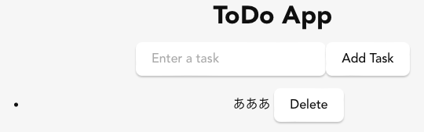

Tauriの練習問題として簡単なToDoアプリを作る。

* [セットアップ](../Tauri-Setup/)
* [簡単なアプリ(MP3プレイヤー)](../Tauri-Player1/)
* Todo(React版)(本記事)
* [Todo(rusqlite版)](../Tauri-Todo-Rusqlite/)
* [Todo(SQLプラグイン版)](../Tauri-Todo-Plugin-Sqlite/)

以前にも[Firebase+Vue.jsでTodoアプリを作ってみた](2020-09-12-Firebase_Vue.md)ことがある。

今回もAIの力を借りながらTodoアプリのフロントエンドを作る。今回の練習問題は、Tauriとはいいながら、Rustのコードは無い。全てのアプリの機能がReact上で実装されている。さらに、データの保存機能もない。ローカルへのデータの保存機能は次回以降で実装予定。

しかし、Firebaseのようなバックエンドサービスを使えば、ログインもデータ保存もネットワークで行うことができる。つまり、純Reactでフロントエンドを作れば、Tauriなど使わなくてもPWAアプリを簡単に作ることができる。その場合は、Tauriはマルチプラットフォームのアプリケーション基盤としての働きのみになり、ロジックとUIはReactで、データ保存はネットワークサービスで、という構成になるだろう。

* フォームに入力されたデータを、`useState`を用いてデータを保持する`tasks`というデータに保存して表示する。
* フォームに入力して"Add Task"というボタンを押せば項目が追加される。
* 項目の横の"Delete"というボタンを押せば項目が消去される。

```javascript
import React, { useState } from 'react';

const ToDo = () => {
    const [tasks, setTasks] = useState([]);
    const [input, setInput] = useState('');

    const addTask = () => {
        if (input.trim()) {
            setTasks([...tasks, input.trim()]);
            setInput('');
        }
    };

    const removeTask = (index) => {
        setTasks(tasks.filter((_, i) => i !== index));
    };

    return (
        <div style={{ textAlign: 'center', padding: '2rem' }}>
            <h1>ToDo App</h1>
            <input
                type="text"
                value={input}
                onChange={(e) => setInput(e.target.value)}
                placeholder="Enter a task"
            />
            <button onClick={addTask}>Add Task</button>
            <ul>
                {tasks.map((task, index) => (
                    <li key={index}>
                        {task} <button onClick={() => removeTask(index)}>Delete</button>
                    </li>
                ))}
            </ul>
        </div>
    );
}

export default ToDo;
```

MP3プレイヤーと同様に、これをApp.jsxの中から呼び出してやれば良い。



次はSQLiteを使ってデータを保存できるようにする

* [セットアップ](../Tauri-Setup/)
* [簡単なアプリ(MP3プレイヤー)](../Tauri-Player1/)
* Todo(React版)(本記事)
* [Todo(rusqlite版)](../Tauri-Todo-Rusqlite/)
* [Todo(SQLプラグイン版)](../Tauri-Todo-Plugin-Sqlite/)
