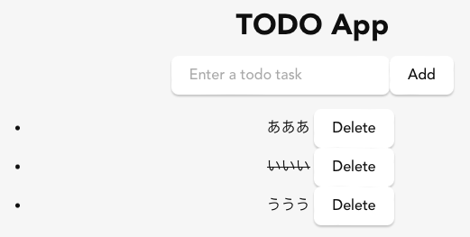

Tauriの練習問題として簡単なToDoアプリを作る。

* [セットアップ](../Tauri-Setup/)
* [簡単なアプリ(MP3プレイヤー)](../Tauri-Player1/)
* [Todo(React版)](../Tauri-Todo/)
* Todo(rusqlite版)(本記事)
* [Todo(SQLプラグイン版)](../Tauri-Todo-Plugin-Sqlite/)

AIコーディングは、Reactはかなり良い感じに生成してくれるがRust、とくにTauriという新しい分野は、あまりちゃんと生成してくれない。今回はRust部分はほとんど手書きだ。

Tauriのデータ保存バックエンドとしてSQLiteを使おうとすると、rusqliteを使う場合と、TauriのSQLプラグインを使う場合がある。

## rusqlite

RustのSQLiteバインディング。本記事では、次のアーキテクチャのToDoアプリを作る。

* データはSQLiteのデータベースでローカルに保存される。
* データベースのハンドリング、データ操作はRust側で行う。
* フロントエンドはReactで作成し、GUI・プレゼンテーテーションのみを行う。データの操作、保存などはRust側のAPIを呼ぶ。

いかにもTauriっぽいアーキテクチャーだ。しかし、現時点ではSQLiteのモバイル環境へのクロスビルドに難があり、これはPC(Linux, Mac, Windows)上でのアプリでしか動かない。

モバイル環境でもSQLiteによるデータ保存を行いたい場合は、TauriのSQLプラグインを通じてSQLiteのデータベースを操作するのが良い。


## rust側

src-tauri/Cargo.tomlにrusqliteを追加する

```
[dependencies]
rusqlite = { version = "0.33", features = ["bundled"] }
```

src-tauri/src/todo-sqlite.rsに、SQLiteのハンドリングをコーディングする。

* テーブルを`struct`として定義して、`#[derive(Serialize)]`を付与しておく。
* データベースの構造体`struct Database`を作り、要素として`Connection`をもたせ、`Mutex`で排他制御する。
* `fn new`で`struct Database`を作成するが、存在しない場合は`CREATE`で自動的に作られる。
* `struct Database`のメンバ関数としてテーブル操作のSQLを実装していく。
* `#[tauri::command]`属性がついたAPI関数を作成する。これらはReact側から呼ばれる。

```
#![cfg_attr(
    all(not(debug_assertions), target_os = "windows"),
    windows_subsystem = "windows"
)]

use rusqlite::{params, Connection};
use serde::Serialize;
use std::sync::Mutex;
use tauri::State;

#[derive(Serialize)]
pub struct Todo {
    id: i32,
    task: String,
    completed: bool,
}

pub struct Database {
    conn: Mutex<Connection>,
}

impl Database {
    pub fn new(path: &str) -> Self {
        let conn = Connection::open(path).expect("Failed to open database");
        conn.execute(
            "CREATE TABLE IF NOT EXISTS todos (
                id INTEGER PRIMARY KEY AUTOINCREMENT,
                task TEXT NOT NULL,
                completed BOOLEAN NOT NULL
            )",
            [],
        )
        .expect("Failed to create table");

        Database {
            conn: Mutex::new(conn),
        }
    }

    fn get_all_todos(&self) -> Vec<Todo> {
        let conn = self.conn.lock().unwrap();
        let mut stmt = conn
            .prepare("SELECT id, task, completed FROM todos")
            .unwrap();
        let rows = stmt
            .query_map([], |row| {
                Ok(Todo {
                    id: row.get(0)?,
                    task: row.get(1)?,
                    completed: row.get(2)?,
                })
            })
            .unwrap();

        rows.filter_map(Result::ok).collect()
    }

    fn add_todo(&self, task: String) {
        let conn = self.conn.lock().unwrap();
        conn.execute(
            "INSERT INTO todos (task, completed) VALUES (?1, ?2)",
            params![task, false],
        )
        .unwrap();
    }

    fn toggle_todo(&self, id: i32) {
        let conn = self.conn.lock().unwrap();
        conn.execute(
            "UPDATE todos SET completed = NOT completed WHERE id = ?1",
            params![id],
        )
        .unwrap();
    }

    fn delete_todo(&self, id: i32) {
        let conn = self.conn.lock().unwrap();
        conn.execute("DELETE FROM todos WHERE id = ?1", params![id])
            .unwrap();
    }
}

#[tauri::command]
pub fn get_all_todos(db: State<'_, Database>) -> Vec<Todo> {
    db.get_all_todos()
}

#[tauri::command]
pub fn add_todo(db: State<'_, Database>, task: String) {
    db.add_todo(task);
}

#[tauri::command]
pub fn toggle_todo(db: State<'_, Database>, id: i32) {
    db.toggle_todo(id);
}

#[tauri::command]
pub fn delete_todo(db: State<'_, Database>, id: i32) {
    db.delete_todo(id);
}
```

src-tauri/src/lib.rsの`invoke_handler`に、`#[tauri::command]`属性をつけたAPI関数を追加する。これでAPIが生成され、React側から呼ぶことができる。


```rust
mod todo_sqlite;
use todo_sqlite::{add_todo, delete_todo, get_all_todos, toggle_todo};

#[cfg_attr(mobile, tauri::mobile_entry_point)]
pub fn run() {
    tauri::Builder::default()
        .manage(todo_sqlite::Database::new("todo.db"))
        .plugin(tauri_plugin_opener::init())
        .invoke_handler(tauri::generate_handler![
            greet,
            get_all_todos,
            add_todo,
            toggle_todo,
            delete_todo
        ])
        .run(tauri::generate_context!())
        .expect("error while running tauri application");
}
```

## React側

package.jsonのdependenciesに`"@tauri-apps/api": "^2.2.0"`があることを確認する。最初に生成されるスケルトンでも使っているので、基本的には入っているはず。

src/ToDoSqlite.jsxにReact側のコードを書いていく。

* `await invoke("")`でRust側のAPIを呼び出してレンダリングする。
* このバージョンのフロントエンドには、アイテムをクリックしたら完了・未完了がトグルし、完了(`completed`)だと取り消し線で表示される。

注意: Jykellのレンダリングのバグを回避するために二重波括弧は間にスペースが入っている。実際のコードでは省くこと。

```
import React, { useState, useEffect } from "react";
import { invoke } from "@tauri-apps/api/core";

const ToDoSqlite = () => {
    const [todos, setTodos] = useState([]);
    const [input, setInput] = useState('');

    useEffect(() => {
        loadTodos();
    }, []);

    const loadTodos = async () => {
        const todos = await invoke("get_all_todos");
        setTodos(todos);
    };

    const addTodo = async () => {
        if (input.trim() === "") return;
        await invoke("add_todo", { task: input });
        setInput('');
        loadTodos();
    };

    const removeTodo = async (id) => {
        await invoke("delete_todo", { id: id });
        loadTodos();
    };

    const toggleTodo = async (id) => {
        await invoke("toggle_todo", { id: id });
        loadTodos();
    }

    return (
        <div style=｛｛textAlign: 'center', padding: '2rem' ｝｝>
            <h1>TODO App</h1>
            <input
                type="text"
                value={input}
                onChange={(e) => setInput(e.target.value)}
                placeholder="Enter a todo task"
            />
            <button onClick={addTodo}>Add</button>
            <ul>
                {todos.map((todo) => (
                    <li key={todo.id}>
                        <span
                            style=｛｛textDecoration: todo.completed ? "line-through" : "none", ｝｝
                            onClick={() => toggleTodo(todo.id)}>{todo.task}</span> <button onClick={() => removeTodo(todo.id)}>Delete</button>
                    </li>
                ))}
            </ul>
        </div>
    );
}

export default ToDoSqlite;
```

実際のSQLiteデータベースはRustのコード(src-tauri/src/lib.rsの`todo_sqlite::Database::new("todo.db")`)で示したようにsrc-tauri/todo.dbに保存される。

```
❯ sqlite3 src-tauri/todo.db
SQLite version 3.43.2 2023-10-10 13:08:14
Enter ".help" for usage hints.
sqlite> select * from todos;
1|あああ|0
2|いいい|1
3|ううう|0
```

MP3プレイヤーと同様に、これをApp.jsxの中から呼び出してやれば良い。


```
❯ pnpm tauri dev
```
とすれば、PC(Linux, Mac, Windows)上ではクロスプラットフォームで実行できる。


次はTauriのSQLiteプラグインを使って、モバイルアプリでもデータを保存できるようにする。

* [セットアップ](../Tauri-Setup/)
* [簡単なアプリ(MP3プレイヤー)](../Tauri-Player1/)
* [Todo(React版)](../Tauri-Todo/)
* Todo(rusqlite版)(本記事)
* [Todo(SQLプラグイン版)](../Tauri-Todo-Plugin-Sqlite/)
